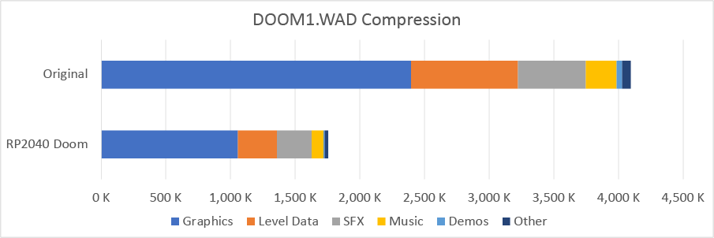
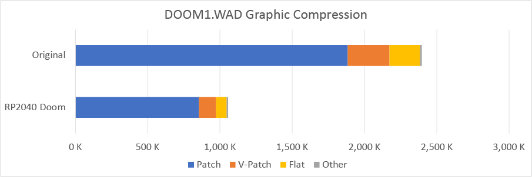
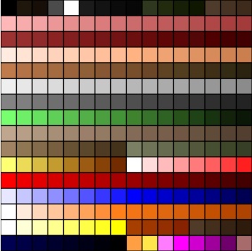
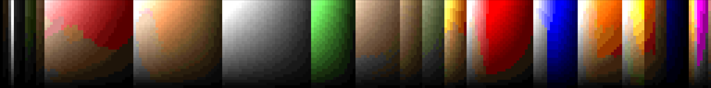
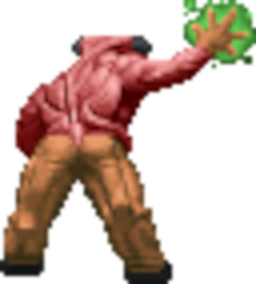
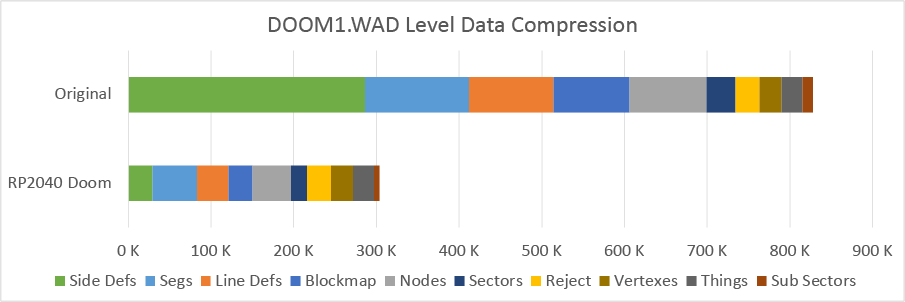
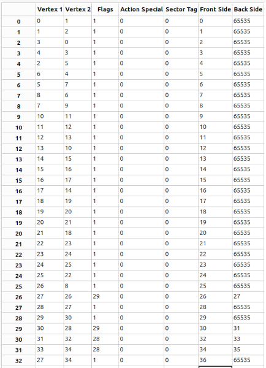
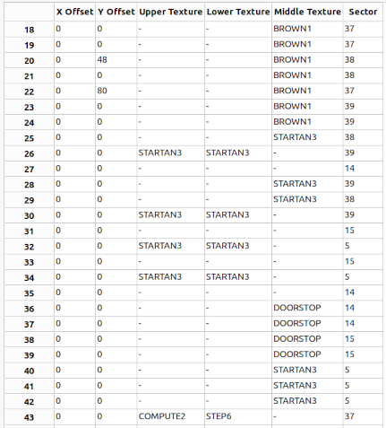
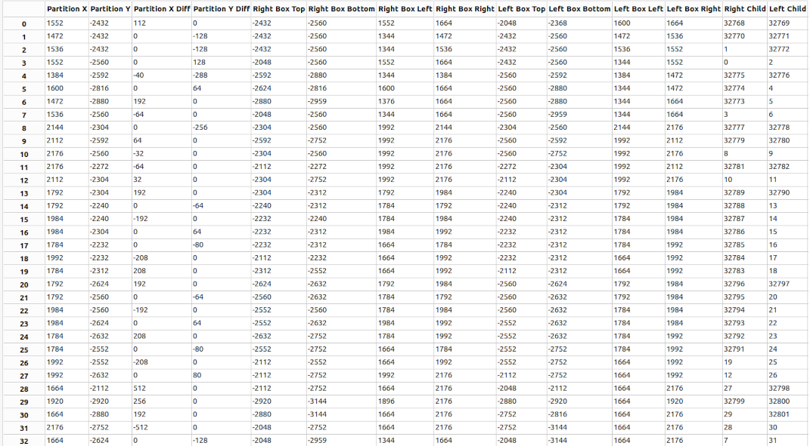

This is part of the series behind the scenes of RP2040 Doom:

* [Introduction](index.md)
* [Rendering And Display Composition](rendering.md)
* Making It All Fit In Flash **<- this part**
* [Making It Run Fast And Fit in RAM](speed_and_ram.md)
* [Music And Sound](sound.md)
* [Network Games](networking.md)
* [Development Overview](dev_overview.md)

See [here](https://www.youtube.com/playlist?list=PL-_wCtHUfdDPi7i-4OIy5iQjQ3QSqq1Mh) for some nice videos of
RP2040 Doom in action. The code is [here](https://github.com/kilograham/rp2040-doom).

# Compression Introduction

As mentioned in the main introduction, everything in the WAD (level data, sound effects, music, graphics and textures) 
must be compressed in order to fit in our tiny amount of flash space. The compression methods used have to allow for 
random-access to all data, as there isn't any spare RAM to decompress even just one level's worth of data into 
RAM 
at runtime.

The WAD may contain tens of thousands of certain types of structures or fields, so every single byte in such 
structures or fields had to be agonized over, as they may each cost 10s of kilobytes or more overall.

The WAD is converted by the new tool `whd_gen` (WHD stands for *"Where's Half the Data?"*) which can produce a `.WHD`
file or a `.WXD` file, the latter being smaller but with more restrictions on the input WAD.

The `DOOM1.WAD` is 4098K big. `DOOM1.WXD` is 1758K, i.e. a healthy 57% compression. This compression is 
basically lossless except for the sound effects which are ADPCM encoded.



In addition to squashing the WAD, I needed to take a hatchet to a lot of the read only data and tables used by the 
Doom Engine, and of course, minimize the size of the actual code itself. The resulting RP2040 Doom executable, with 
code 
and 
static data, all fit into 256K of the flash. 

This leaves 34K (woot) on a Raspberry Pi Pico, with its 2M flash, to persist up to six saved games. Since vanilla Doom 
saved 
games range from about 10K to 60K+, the saved games also need to be heavily compressed!! 

This whole section gets quite involved in places, so no one will be offended if you 
just skim through to whichever ones you think are more interesting!

# General Compression Methods

The following general lossless methodologies are used to compress data:

1. **Smaller data types**: If a 16-bit integer will do, use that instead of a 32-bit integer.

2. **Packed C bit-fields in structures**: Occasionally this can be used to 
   shrink a structure whilst keeping the structure properly aligned (e.g. using two 12-bit values to fit in 3 bytes).

3. **Compressed structures**: Whilst changing data types can minimize the size of structure, it necessarily applies
   to  *all* instances of a particular structure. However, I noticed that often some individual fields of a structure 
   may be:

   1. Frequently, but not always, zero.
   2. Frequently, but not always, 1 byte not 2 bytes.
   3. In some way predictable based on other structure fields, or external information (e.g. the structure's index 
      within an array).
      
   I can take advantage of such probabilistic information to devise a menu of different encodings for the structure.
   Therefore, a set of bit flags are included in the structure that indicate which of the various possible 
   encodings are in play for that instance, dictating the particular size of the structure for that instance.
   In this way the expected 
   (average) size of the structure is 
   reduced.
   
   Macros or functions are used at runtime to decode structure fields, and use non type-safe `uint8_t *` 
   pointers to refer to instances. Integer indexes into arrays of such structures can be replaced by integer byte 
   offsets from the start of the array, and arrays of structures can still be iterated in order, since the 
   size of each element can be determined. 

4. **Variable byte-count integers** Sometimes, when their sizes are often expected to be small, integers are encoded 
   as a 
   variable number of bytes, LSB first, with 7 significant bits and a flag in each byte. The flag indicates whether another byte of significant bits follows. 

   For signed integers the values are "zigged" into unsigned values by renumbering 0,-1, 1, -2, 2, -3 to 0, 1, 2, 3, 
   4, 5 etc. These types of variable-number-of-bytes integers are generally used in otherwise byte-centric streams of data.

5. **Variable bit-lengths**:
   For unstructured data, the data stored is just a series of values. 
   It is much 
   more 
   efficient to encode these values as arbitrary bit lengths, rather than in multiples of bytes.

   The data is therefore encoded as bit-streams with the bit-length of each value dependent on the value type and 
   its context. Whilst 5 bits may *always* be used for one certain value type, it is often possible to use additional 
   contextual 
   information to 
   optimize these bit lengths further. 
   
   As an example, if you are 
   encoding the run-length of opaque pixels in a vertical strip of a graphic, the 
   number of bits needed to encode the run-length is certainly no more than required to store the remaining length of 
   that strip to the 
   bottom of the graphic from where you are.

6. **Huffman Coding**: Sometimes it is not just the context of the value that best determines the bit-length used to
   encode it, but also its probability. When one value ("symbol") is more likely than others, a sequence of 
   symbols can be compressed by using shorter bit-lengths for common symbols, and longer bit-lengths for rare 
   symbols.

   In Huffman Coding, symbols are assigned "codes" (a unique string of bits) where no "code" is the prefix 
   of another.  

## More on the RP2040 Doom Huffman Coding   

Huffman coding converts a string of input symbols into a series of variable bit length prefix codes. What the 
symbols represent is entirely up to the use case.

Many compression methods (e.g. *Zip*) use an input symbol alphabet which includes raw byte values, but also 
symbols for references to previous sequences of bytes in the stream. (e.g. one symbol might represent the byte `0x41` 
and another 
might represent 
*"the 
sequence of 7 
bytes 
just decoded 32 bytes ago"*). This is called (LZ77) dictionary compression and is very efficient when you expect many 
sequences of bytes to repeat.

Such dictionary compression methods are suited to long streams of data where you can keep significant decoded 
history data to copy byte sequences from (*Zip* keeps 32K by default). You *cannot* decode just a short sequence in the 
middle, 
without decoding everything before it. RP2040 Doom needs to be able to encode and decode really short (10s of bytes) 
sequences of 
data,
so 
the dictionary method is a bad choice.

Like *Zip* however, an optimal set of Huffman Codes are generated based off 
the probability distribution of the input symbols measured at compression time. These 
codes might be common to an entire graphic, but can still be used to decode just one column of that graphic 
independent of 
the rest. 

The decoder must know the Huffman Codes that were used by the encoder, so the codes or the probability distribution 
must be stored too. Again like *Zip*, the code lengths for 
   each symbol in the input alphabet are what is stored, which is sufficient information for the decoder to 
regenerate the 
Huffman Codes.

In the simplest case, the input symbols universe might just be the 256 
   possible 8-bit values representing palette indexes used in a graphic. Some possible symbols are never used 
   in a particular entity, so are assigned a code length of 0. The remaining one are assigned codes according to 
   their frequency (e.g. if a graphic only used palette 
   indexes A, B, and C, and A was the most common, then they would be assigned bit lengths 1, 2 and 2. From this 
   information both the encoder and decoder can derive a common set of codes (e.g. A = `0`, B = `10`, C = `11`).

   In the above example only 3 out of 256 possible symbols are used and thus have codes, and this 
   sort of sparseness is common. This known sparseness, along with additional knowledge RP2040 Doom has about  the 
   input symbol 
   alphabets, 
   can be used to devise ultra-compact packed representations of the used symbols and 
   bit-lengths 
   according to entity type. This is slightly different from *Zip* which has no a-priori information about the 
   likely distribution of the input data bytes themselves, and thus uses some extra meta-levels of Huffman Codes to 
   describe the symbols' code lengths compactly.    
   
   Much of the hard work here of course is picking a set of symbols to encode. Whilst raw input 
   bytes are used as a possible symbol alphabet in the examples above, compressing these directly does not generally 
   yield the 
   amount of compression required, so higher-level symbols must often be fashioned, with much more differentiating 
   probability distributions.

# Compressing the WAD

The WAD in Doom is made up of named *"lumps"* which are individual assets (graphics, sounds, level elements, etc.) 
that are combined into a coherent whole by the game engine. The vanilla Doom engine supports combining WAD files 
together at runtime allowing one WAD to override lumps in another WAD by name.

Since RP2040 Doom requires a single read-only WHD (our version of WAD) image in flash, any 
ability to 
patch the WAD at 
runtime is removed.
If the user wants to alter base WADs they can do so with existing host side tools before generating the WHD. When 
the WHD is generated, therefore, 8 character lump names can be replaced with 2 byte lump 
numbers saving some 
space. Not all names can be removed as some are referenced explicitly by the Doom code. 

The remainder of the space-saving comes from actually compressing the lumps within the WAD.

You can refer to [Doom Wiki - WAD section](https://doomwiki.org/wiki/WAD) to get a bit more detail about the 
types of lumps mentioned below. 

This section uses the shareware `DOOM1.WAD` as an example, as this is the target needed to be fit in the 2M flash on
the Raspberry Pi Pico.

It turns out that for `DOOM1.WAD` pretty much everything that could reasonably be compressed, needed to be in order 
to get
everything to fit in 2M.

The ( %) in the headings are the savings for each item in `DOOM1.WAD`.

## Graphics Compression (56%)


### Patches (54%)

A *patch* in Doom is a graphic made of vertical runs (*posts*) of pixels. These are used for sprites, wall textures, 
menu 
graphics etc. (basically any graphical element except for floors and ceilings). Patches are stored vertically 
because all sprites and wall textures are rendered as vertical strips by the Doom engine. This rendering order is 
convenient as all such vertical strips have the same Z value, so no perspective correction or light level 
adjustment is needed down the strip, and so the rendering loop can be *very* fast.

In RP2040 Doom the patches that are not used for 3D rendering (i.e. not game sprites and parts of wall textures) are
treated as a separate category called (by me) "V-Patches" and handled completely differently. The compression of these 
V-patches 
is described 
later.

RP2040 Doom takes the size of regular patches in `DOOM1.WAD` from 1880K to 851K.

This is what a patch looks like in vanilla Doom.
```
Patch:
Field      Type       Size       Offset      Description
width      uint16_t   2          0           Width of graphic
height     uint16_t   2          2           Height of graphic
leftoffset int16_t    2          4           Offset in pixels to the left of the origin
topoffset  int16_t    2          6           Offset in pixels below the origin
columnofs  uint32_t[] 4 * width  8           Array of column offsets relative to the beginning of the patch header

Each column is an array of post_t, of indeterminate length, terminated by a byte with value 0xFF (255).
Field      Type       Size       Offset      Description
topdelta   uint8_t    1          0           The y offset of this post in this patch. If 0xFF, then end-of-column 
length     uint8_t    1          1           Length of data in this post
unused     uint8_t    1          2           Unused padding byte; prevents error on column underflow.
data       uint8_t[]  length     3           Array of pixels in this post; each data pixel is a palette index 
unused     uint8_t    1          3 + length  Unused padding byte; prevents error on column overflow

```

Note: there are 44577 patch columns and 61731 posts in `DOOM1.WAD`

The following explains how RP2040 Doom deals with the the regular patches:
  
* The pixel data is separated from the "patch metadata" which describes the individual pixel run lengths.

* A single set of symbols and code lengths is used to encode all the pixels in the patch. There are two different 
  possible encoding schemes (way of assigning symbols) used, and the one which compresses the patch the best is chosen.

* Data remains accessible column by column.

* Identical columns are not encoded twice.

* Fully opaque patches, which are quite common for patches used as wall textures, are flagged as such, and no post 
  metadata is kept.

* Unlike vanilla Doom, no padding bytes are stored. Each patch column is decoded into a temporary buffer at runtime 
  before rendering, and 
  that runtime buffer is padded with duplicate bytes at the top and bottom to achieve the same protection.

#### Encoding pixels

Each post within the patch is stored as a sequence of symbols according to the encoding scheme chosen.

This is either:

1. The simple version. Each symbol is just a palette index for a pixel. Compression occurs, because some pixel colors 
   are more likely than others within the patch. Also, most patches have considerably fewer than 256 different colors,
   so the Huffman Codes for each pixel value even if evenly distributed, would naturally be shorter 
   than 8 
   bits.

2. The more complex version, which turned out to be necessary because just performing the above compression does 
   not save enough space, saves another 130K or so by taking 
   advantage of the nature of the graphics and the palette used in Doom. This is described below:

Given that only 256 colors are available, and to better support the atmospheric lighting, the vanilla Doom 
palette is split into a bunch of color bands as shown below: 



The vanilla Doom engine supports rendering any color
at one of 32 different brightnesses. However, the color used for each brightness for each of the 256 colors in the 
palette, 
must itself come from the same palette. The use of color bands makes this effect much more pleasing:



The sprites themselves were based on real world models and very often, large areas are made of the same basic 
color, and thus in the same color band:

   

Most importantly the palette is ordered such that lighter and darker versions of the same base color are at adjacent 
palette indexes. As you see in the boss image above, there are often smooth color variations as you move down a column 
in the patch, and because of the palette ordering, these color variations map to small changes in palette 
index 
from 
pixel to pixel.

To take advantage of this, in the second encoding scheme, an *extra seven symbols* are added in addition to those 
for the raw palette indexes, and encode a delta from the previous palette index in the column.
Deltas in the range -3 to +3 were selected, as these turn out to be most beneficial (hence 7 different symbols). 
These 
new *delta* symbols are common as they cover a wide range of smooth color variations, and therefore tend to have 
shorter 
bit lengths than the raw colors they 
replace.

I tried a bunch of other - what I thought were fantastically clever - encodings, but the moral of the story 
seems to be that adding complexity generally adds an equal amount of encoding overhead, so. sticking with this 
simple strategy actually gave the best results.

Side note, and lesson learned while playing with the pixel encodings: *If it seems to good to be true, it probably 
is!*
I learned my lesson early on to always decode what I had just encoded for validation before I put that space-saving in 
the bank. Sadly even this wasn't even enough, and at one point I found 
that I had 
saved an amazing about of space, only to realize that I had accidentally left in some pixel pre-processing I was 
using to visualize possible compression techniques by looking at PNGs of the patches. These modified images compressed 
really well, and decoded correctly back to themselves, but of course weren't the data I was supposed to compressing!

#### Encoding patch metadata

The header in RP2040 Doom is now 6 or 8 bytes:
```
flags      uint8_t    1                (fully-opaque, 2-byte-offsets, byte-column-offsets)
width      uint16_t   2                Width of graphic
height     uint8_t    1                Height of graphic
leftoffset int16_t    1/2              Offset in pixels to the left of the origin
topoffset  int16_t    1/2              Offset in pixels below the origin
```
followed by Huffman Code information for pixel decompression:
```
decodesz   int8_t     1                Size of decoding tables (/2) that will be needed to decode pixel data
encdoing   ?          variable         Encoding of Huffman Codes for pixel data.
```
and then the column offsets:
```
columnofs  uint16_t[] 2 * (width + 1)  Array of column offsets relative to the beginning of the patch header
```
The compressed patch data always fits easily within 65536 bytes, so 16 bits is fine for the column 
data 
offsets. Since all the data is encoded as bit streams, byte alignment is not required. If 16 bits is good enough to 
encode 
all the column data offsets as bit offsets rather than byte offsets, then the column data is packed on bit 
boundaries rather than byte, thus saving on average `patch_width/2` bytes per patch.

The most fun perhaps (and you may have noticed the `columnofs` array has grown by one) is that RP2040 Doom actually 
needs to 
store two sets of data per column; the pixel data and the metadata describing the post lengths. Since there are 40K+ 
columns, I don't want to keep two lengths, so I sandwich the data between `columnofs[x]` and 
`columnofs[x+1]`. The compressed pixel data is stored and decoded forwards from the column offset, and the compressed 
metadata is 
stored and decoded *backwards* from the next column offset. An explicit length is not stored for either piece; it is 
up to the 
decoder to know how much data to read (the security conscious can get back up off the floor!)   

One final wrinkle, is that offsets of the form `0xffnn` are reserved to indicate that the offset is not an actual 
column 
offset 
to the data for this column, but rather that this column is an exact copy of column number n.

### V-Patches (59%)

As mentioned above, these are the subset the patches that are not part of the 3D view itself, i.e. they are 
graphics for the menus, status bar, 
intermission screen, etc. I named this category "V-Patches" as they are traditionally rendered in 
vanilla Doom by 
`V_DrawPatch` related methods.

RP2040 Doom takes the V-Patch size in `DOOM1.WAD` from 286K to 117K.

If you read the section on [rendering](rendering.md), you'll know that these V-patches must be drawn as horizontal 
strips
rather than vertical strips, and that a lot of them must also be drawn, very fast, every frame.

The potentially large number of different V-patches used in any one frame, and the up to 60fps rendering speed 
required, both preclude using the regular Huffman Code based pixel compression, so instead, fixed bit-width 
values are used for each pixel:

* Depths of 4, 6 and 8-bit are supported. Generally these ranges (up to 16, 64 and 256 unique colors) are good 
  characterizations of the 
  sorts of graphics which are used as V-patches. On rare occasions (mostly the red menu text) the number of colors 
  may 
  be reduced from 17 say to 16 with little noticeable effect.

* Usually each V-patch stores its own n-bit index->8-bit palette color mapping, but referring to a 
  shared color-mapping is also supported. Three such color mappings in use in RP2040 Doom, one for 
  example is used for all the previously mentioned red menu text. These shared color-mappings used are actually used 
  for speed reasons rather than 
  space reasons, as the palette can be pre-converted once, saving an extra lookup per pixel in the V-Patch rendering 
  loop.

* For each bit depth supported, up to three different encodings as needed to handle transparency:

  1. **Fully Opaque**. If a V-Patch is fully opaque, it can be marked as such avoiding the need to store any other 
      transparency information, but more importantly, allowing it to be rendered much more quickly at runtime.
  2. **Transparent Index**. An n-bit value is stored for every pixel, but the value 0 is used to indicate transparency.
  3. **Oppaque/Transparent Run-lengths**. Lengths for each run of opaque or transparent pixels within a 
      V-patch row are stored. n-bit pixel values are only stored for the opaque runs of pixels. This is generally more 
      compact and 
      faster to render than the *"Transparent Index"* type, except when dealing with small fiddly font glyphs.

The data for each pixel row within a V-Patch is stored in such a way that, given a data pointer to the start of the row 
and the V-Patch width and encoding, a row can be rendered leaving the data pointer pointing to the next row. This 
facilitates drawing the V-patch incrementally, line-by-line, whilst maintaining mimimal state. 

### Texture Data (16%)

A *"texture"* in doom is used to cover the vertical walls (or parts of walls) in the 3D View. Each texture is "composed"
by drawing one or more patches onto a logical canvas of a certain size. The use of patches, rather than 
storing each texture as its very own bitmap, allows a much wider variety of textures to be created in a small mount of 
space. The same small selection of say "stone-like" patches can be place next to, or over each other, creating set of 
larger more 
random diverse looking textures. Additionally, "decal" patches can be drawn on other patches to customize textures 
as is often done for "switches" in Doom.

Vanilla Doom creates some large runtimes structures in RAM to describe the net effect of all this compositing on 
each column within each texture, and indeed keeps a cache of pre-rendered columns since they are quite 
expensive to draw.

In RP2040 Doom, there is no space for these runtime RAM structures, so additional data is encoded in the WHD 
describing key facets of the texture for direct use at runtime. Fortunately this additional data, after suitable 
compacting 
measures, still ends up smaller than the original texture information.

The vanilla Doom texture information, includes basics such as width and height, along with a list of patches, and the 
coordinates they are drawn at.

In RP2040 Doom:

* The basic width, height data etc. are stored compactly along with new bit flags.

* Any texture which is made of a single patch drawn at the top left of the texture is flagged as such. It is not 
  uncommon for 
  a single patch to be used as a wall texture, and so no additional metadata is stored for this type of texture. Note 
  that 
  all textures with transparency happen to be of this type too.

* If there is more than one patch, additional metadata is kept that is described below. This metadata contains a 
  local palette of (up to 16) patches used within the texture to avoid referring to textures by their full 16-bit 
  identifier.

The rendering path at runtime is much more costly for any texture column that doesn't just consist of a single column 
from a single patch. Often, textures have many single patch columns even if other columns are "composite" (drawn from multiple patches).
An example of such a texture with some single patch columns and some "composite" columns, would be a large 
patch which has a 
smaller patch opaque rectangular patch drawn in the center. The texture columns to the left and right of the center 
patch, 
are 
identical to 
single columns in the larger patch, and are thus called "one-patch" columns.

A very simple run length encoding is kept of alternating counts of "one-patch" vs "composite" columns across the 
texture.
In the above example, it might be 96 "one-patch" columns from patch A, then 64 "composite", and finally 96 
"one-patch" from patch A again.
This run-length metadata is used early on in the RP2040 Doom scene rendering to identity texture columns that are 
actually 
just patch columns (in this case patch A), and send them down a much faster rendering path.  

#### Composite Columns

Another series of run-lengths across the texture is kept for runs of "composite" columns that are drawn from the same 
source 
patches in the same way. In the simple example above, all the 64 "composite" columns would be in the 
same run, as they have some of patch A at the top, some of the smaller patch B in the middle, and some of patch A 
at the bottom. The only difference from one column to the next is the x-position of the source data in patches A & B. 

All columns in the run are drawn in the same way. and the metadata stored for the run is a set of drawing commands 
used to "compose" the column. Each simple command draws a contigous vertical strip of pixels.
In the example above, 128 pixels might be drawn 
from 
local patch 0 as the background and 40 pixels 
from local patch 1 at y position 60 on top. 

Each drawing command type is a variable number of bytes, and is comprised from the following:

* **End of strips marker (1 bit)**: marker for the end of the strips used for this run of columns.
* **Strip length (7 bits)**: The length (height) of the strip minus one.
* **Local Patch Number (4 bits)**: the local patch to draw from (if any).
* **Flags (4 bits)**: `explicit_y`, `memcpy`, `memcpy_source`, `memcpy_backwards`
* **Starting y-offset (8 bits)**: Only present if `explict_y == 1`, this is used to draw over previously drawn 
  pixels, 
  instead of immediately following on from the bottom of the previous command.
* **X/Y-offsets (8 bits each)**: Only present for regular (`memcpy == 0`) columns, these indicate the 
  pixel 
  used 
  for the 
  top of this command in the left-most column in the run.
* **Source position (8 bits)**: Only present for `memcpy == 1`, columns, indicates the source 
  position in the texture 
  column to copy from.

These commands are interpreted at runtime to render the column into a temporary buffer containing the composited 
texture column, which is then immediately used for rendering.

The command set is calculated and optimized by the `whd_gen` tool to minimize the number of strips and use `memcpy` 
when possible. For example, if the same patch source column is repeated in the same texture 
column, using `memcpy` avoids the need to decompress the same source patch multiple times when compositing the 
texture column. As a further optimization, the `memcpy` can be done in either 
direction to either 
cause or prevent overwriting the source data during the copy. Overwriting the source data can be useful, as there are 
frequently 
textures which are 
the same patch 
stacked 2, 
4, 8 or even 16 times on top of each other, and `whd_gen` is able to optimize the instructions to just draw the first 
patch,
and then do a single `memcpy` for 15x the distance in order to draw the rest. 

Finally, note the `memcpy_source` flag. At runtime, as an optimization, only as much of the column as is 
actually visible anywhere in the frame being rendered is decoded. Often the level design has some portion 
of a given texture always invisible above the ceiling or below the floor. Pixel runs that are the source of a `memcpy`
must be marked, so that their pixels are *always* drawn to the buffer, even if not visible, in case they are copied to 
otherwise 
visible 
areas by `memcpy`.

### The Doom Palettes (97%)

As discussed above, the Doom has a 256 color palette which is a total of 768 bytes (8-bit R,
G and B for 
each 
color). However, 
the WAD 
actually 
stores 33 additional copies of the palette, tinted towards different colors, mixed with red for pain, mixed with 
green for item collection etc. Assuming all
the WAD palettes can be derived exactly from the base palette using the original Doom formula, the `whd_gen` tool omits 
all 33
remaining palettes, saving a bunch of space. There is plenty of time at runtime - at most once per frame - to 
calculate the
actual tinted palette.

---

## Level Data Compression (63%)

After the graphics, the level data itself is the remaining majority of the WAD.

In vanilla Doom, the game does not run directly off the WAD data in memory. Instead, a single level's worth is 
instantiated into more efficient RAM structures at runtime. This is because the WAD was stored on 
disk, which wasn't fast enough to access during gameplay, but also because they needed to be able to stitch multiple 
WADs together at runtime.

Whilst our WHD data stored in flash isn't as fast as RAM, there is no spare RAM to copy the data to, so the data in 
flash must be used directly.

But as already stated, the data must also be compressed, so that compression must be done in such a way that RP2040 
Doom 
can use the 
compressed data directly at runtime. There is certainly some runtime overhead for the decompression of compressed 
data at 
runtime, but this is actually probably amortized quite a lot by the reduction in slow flash traffic anyway.

I can moan as much as I like, but I have to make it the data small enough, and if I have to reclaim speed somewhere 
else, 
then so bet it!

This is the compression we achive for the various level data elements in `DOOM1.WAD`:



What follows is a brief(?) description of all the different types of level data lumps and how they are compressed. The 
italicized 
quotes are a 
brief description of the level data lump type, many of which are taken from the Doom Wiki.

All of the compression 
techniques are used in `WXD` file used to squeeze `DOOM1.WAD` onto the 2M Raspberry Pi Pico, but some are currently skipped for 
WHD files used when converting *Ultimate Doom*,
or
*Doom II* WADs for larger flash sizes. These larger WADs exceed some of the limits currently imposed by the `WXD` 
format, but these WADs are less constrained in 8M than `DOOM1.WAD` is in 2M, so the most aggressive compression is not 
needed.

Note that there is one of each type of lump per level.

### LineDefs (62.58%)

*"Linedefs are what make up the 'shape' (for lack of a better word) of a map. Every linedef is between two vertices 
and contains one or two sidedefs (which contain wall texture data)."*

If you look at the following table you see that there is a huge correlation between many columns and the index 
within the array (first column). This happens as a result of the way the level data is exported by the level editor; 
note that all the WADs I have tried exhibit this behavior, but if not, it would be theoretically possible for 
`whd_gen` to perform a reordering. 



Rather than storing a 16 bit vertex index for "Vertex 1", and "Vertex 2", an 8-bit signed difference 
between the value and a "predicted" value can be stored. The predicted value is just a linear interpolation between 0 
and the 
maximum vertex number across the range of the array. 

I also noted that "Action Special" and "Sector Tag" are often 
(always in the 
subset shown) zero, and I can therefore use a variable sized struct field and a flag to say whether the 
value is stored. 

Finally, you'll note that "Back Side" is always either 65535 or `"Front Side" + 1` 
(another artifact of the level export) and thus that field can actually be encoded in a single bit!

Note: when discussing *predicted* values, I'd said that the predicted vertex value was linear with array index. 
However I cannot use array indexes to refer to "linedefs" since they are variable-sized structs, and for those, 
byte-offsets are used rather than array indexes to refer to array elements. The good news is that the byte 
offsets are just as reasonable a basis to use for the prediction as array 
indexes; I can just predict `vertex_count * lindef_byte_offset / linedefs_total_byte_size` instead.

### SideDefs (90%)

*"A sidedef contains the wall textures for each linedef, with texture data, offsets for the 
textures and the number of the sector it references (this is how sectors get their 'shape')."*

I also make "sidedefs" variable-sized structs because various fields are often zero, or can often be stored in one 
byte not two.

Additionally though, each "sidedef" references three textures, a "top/upper", a "middle" 
and a
"bottom/lower".
Space has already be saved by using 16 bit lump numbers rather than names for each of these textures, however 
with 
30000+ "sidedefs", storing 6 
bytes
per "sidedef", the size still *really* adds up.

Fortunately, once again, there is a lot of correlation within the texture values for an individual "sidedef":

There are actually only 16 possible patterns of texture values; the 8 obvious ones where each of the 3 textures 
places is 
either set to its own unique value or is blank, and 8 additional ones where the same texture name appears in more 
than one place. Fortunately for us, the majority of patterns only require a single texture name, as seen in all but 
the last "sidedef" below. Therefore, I just store the 4-bit pattern selector value, and then append as many texture 
number(s) as the pattern requires.



### Segs (57%)

*"Segs are the portions of linedefs making up the border of a subector."*

RP2040 Doom saves about 50% by using variable sized structures and some custom fixed bit-width fields.

### SSectors (Sub Sectors) (50%)

*"Sub sectors represent a convex region within a sector. They are a list of any segments which lie along their 
boundary."*

This is how the vanilla Doom WAD stores a sub sector:

```
typedef PACKED_STRUCT (
{
  short		numsegs;
  // Index of first one, segs are stored sequentially.
  short		firstseg;	
}) mapsubsector
```

RP2040 Doom saves exactly 50% because we can avoid the `numsegs` field. The segments are *already* stored in sub sector 
order, so the number of segments in sub sector `n` is actually just `subsector[n+1].firstseg - subsector[n].firsteg`

### Nodes (50%)

*"The nodes lump constitutes a binary space partition of the level. It is a binary tree that sorts all the 
subsectors into the correct order for drawing in the 3D view. Each node entry has a partition line associated with it 
that 
divides the area that the node represents into a left child area and a right child area. Each child may be either another node entry (a subnode), or a subsector on the map."*

Here is some node data from a level in `DOOM1.WAD`:



There seems to be a bunch of data here, but it can be hacked away at, fairly well.

Firstly the last 2 fields (Right Child/Left Child) can be reasonably well predicted based on node index similarly to 
previous types of level data, after the top `0x8000` bit which indicates whether this is a sub sector 
leaf 
index or a child node index for each has been masked off. RP2040 Doom stores these two bit flags, and the deltas from 
the 
predicted 
values for 
both left 
and right in 16 bits total, although different encodings are used depending on the sub sector/leaf status 
of the children.

Additionally, there is some slightly wasteful information stored for each node. There are 8 16-bit values 
used to describe the bounding box for each child of the node. These bounding boxes are intersected with the view 
frustrum at runtime to 
determine if the child node (and thus any of its subtree) is possibly visible on screen.

I have said two important things in that sentence:
1. That the children's bounding boxes are necessarily contained 
within the parent's bounding boxes.
2. That this is just an optimization; it doesn't matter if our bounding 
boxes are slightly too large.

Therefore, instead of storing 4 16-bit values per child, 4 4-bit values are stored that describe the bounding box of 
the 
child on a 
16x16 grid laid over the bounding box of the parent. I did calculate the over-coverage at one point, and I think it 
is pretty miniscule, though I don't recall the number now.

### Blockmap (68%)

*"The blockmap is a data structure used for collision detection. 
The blockmap is simply a grid of "blocks"' each 128×128 units. Every block contains zero or more linedefs indicating
which linedefs intersect with that block."*

Vanilla Doom stores 2 bytes per block which is an index into a single array of the block map's "linedef" numbers  
where that block's list of "linedef" numbers are stored. That list starts with a `0x0000` value, and the list 
is terminated with an `0xffff`. The "linedefs" numbers for the block are contained between those two markers.

This means that even an empty block that is crossed by no-lines takes 6 bytes, and as you can imagine if you imagine 
a Doom level drawn on a grid, such empty blocks/space are not uncommon.

The RP2040 Doom storage of the "blockmap" is perhaps the most agressive/complicated of the level data:

* For each row (same y-position) in the "blockmap", a 16-bit base index is stored, along with a bitmap with 1-bit for 
  each 
  block 
  x-position indicating whether that block is non-empty.

* A 16-bit value for each non-empty block in the row is stored sequentially starting at the 16-bit base index for 
  the row that was mentioned above. This is 16-bit value is located quickly at runtime by counting set bits 
  in the bitmap from the start of the row.

* A value with bit pattern `0b ffff nnnn nnnn nnnn` indicates a block with a single "linedef" number `n`.

* A value with Bit pattern `0b cccc ccxx xxxx xxxx` indicates a block with `c+1` "linedefs", which start `x` bytes after 
  the end of the row's block-population bitmap.

* Each "linedef" is stored as a variable-byte-count integer. 

### Sectors (46%)

*"A sector is an area referenced by sidedefs on the linedefs. It stores the floor and ceiling textures (flats), along 
, floor and ceiling height, lighting level and other flags for a region within the map."*  

Currently, lump names are just converted to indexes. I could save an extra byte here easily enough, but 
then it 
would blow the 16-bit struct alignment for very little saving, as there really aren't that many sectors.

### Things (0%)

*"Things represent players, monsters, pick-ups, and projectiles. They also represent obstacles, certain decorations, 
player start positions and teleport landing sites. While some, such as projectiles and special effects, can only be 
created during play, most things can be placed in a map, and are created when the level is loaded. The Things lump 
stores these items."*

RP2040 Doom does not currently compress this lump type. Vanilla Doom stores 5 fields in 10 bytes, and this could be 
shrunk 
to 8 by 
converting the angle/flags field to one byte each, however this only saves about 5K over all.

### Vertexes (0%)

*"Vertices are nothing more than coordinates on the map. Linedefs and segs reference vertices for their start-point and end-point.
The VERTEXES lump is just of a raw sequence of x, y coordinates as pairs of 16-bit signed integers."*

The full 16 bits of the coordinates are needed, and the vertexes are not stored in any predictable order, so this 
lump type is not compressed.

### Reject (0%)

*"The Reject lump is used to speed up line of sight calculations. For every sector there is a bit stored 
for every other sector indicating whether any of that other sector is visible from the first sector."*

Even though this lump type is fairly sparse, it is hard to compress it and maintain random access.
Therefore, this lump type is not currently compressed, although if really needed to, I would probably have tried a 
Bloom 
Filter.

----

## Sound Effect Compression (49% lossy)

In vanilla doom these are stored as 8-bits mono samples. RP2040 Doom uses ADPCM to lossily compress them to 4-bit 
samples 
along with extra metadata for groups of samples.

## Music Compression (62%)

RP2040 Doom takes the size of the MUS music (A Doom format similar to single track MIDI) from  
240K to 91K. Currently, only the MUS format is supported, as this the only format used in the regular Doom WADs, even 
though Chocolate Doom supports full MIDI too. Previously I had a technical reason not to support multi-track 
music, however this limitation was tied to the 
previous Zip-like compression I tried, and so no longer really applies.

A Doom MUS file is made up of a series of events; each event starts with a first byte:

`0b LEEE CCCC` - where `EEE` is one of 8 event major event types and `CCCC` is the 4-bit channel number.
Each event byte is followed by a variable number of bytes depending on the event type, and the data for the current
event is immediately followed by the first byte of the next event, unless the current event has the `L` (Last) bit in 
its lead byte set. In this case, this is the last event in a group of events for the same time code, and
is followed by a time delta encoded as a variable-byte-length integer. 

There are a 6 major event types used in the MUS format; the highlighted value in `{}` is the event data payload if 
any:

1. **Release note `{note number}`**. Release the specified note on this 
   channel.
2. **Play note `{note number}` `{note volume}`**. Play the specified note at the special volume on the 
   specified channel. The note volume can be omitted, in which case the previous volume used on this channel is used.
3. **Pitch wheel `{pitch change}`**. Bend the notes on the specified channel up or down in pitch.
4. **Change controller `{controller number} {value}`**. Affect various attributes of the specified channel including 
   pan 
   position, 
   volume, vibrato, reverb, in addition to instrument selection, and a few others.
5. **System event**. Other non-channel related events (the system event type is stored in the channel slot).
6. **End of track**. Just that!

The entire crux of the compression is to find a sensible set of symbols to encode all the data from the MUS as 
compactly as possible using Huffman Coding. The encoding ends up using a good number of different probability 
distributions for data based on the context within which it is found.

First the MUS events are trans-coded into eight major event types of my own, incorporating the commonly used ones as 
first-rate citizens:
```
typedef enum musx_event_type 
   system_event = 0x0,
   score_end = 0x1,
   release_key = 0x2,
   press_key = 0x3,
   change_controller = 0x4,
   delta_pitch = 0x5,
   delta_volume = 0x6,
   delta_vibrato = 0x7
};
```

### Event Group Encoding
Rather than the original one-byte header, all the events for a single time code are represent as the following 
single sequence of symbols:

`{group_length_symbol}` `{channel&event)` `... event payload ... ` `{channel&event)` `... event payload ... ` `{time 
delta}`

The first symbol is just the number of events that follow for the same time code. This length symbol (with its own 
Huffman 
Code distribution) gives better compression on average than one bit per event!

Channel & Event are combined into a single symbol because different events are more or less likely, indeed some event 
types are not present, on some channels versus others. Additionally, not all channels are used in a given song, and 
therefore do not 
need codes. Every used channel/event pair has its symbol with its own code length.

### Individual Event Encoding

The data for each event type is then itself encoded using a custom set of per event type symbols. You'll notice 
above 
that there are `delta_pitch`, `delta_volume`, `delta_vibrato` whereas the original MUS actually uses absolute values. 
Generally these values change by small increments throughout the song, and so more compressible 
probability distributions result from using deltas than absolute values. A different probability 
distribution is actually used for each of 
pitch, volume, and vibrato. 

Additional effort is taken to save space on common events like `press_key` and `release_key`:

For `release_key`, you can only release one of the notes that is already pressed on that channel, so the 8-bit  
note 
value is overkill. I therefore just encode the "distance" of the note being released, with the closest distance 
being 
the 
last note that was "pressed" on that channel. Different distributions are used based on the current length of the 
history, since clearly if only one note is pressed, you don't actually need any bits to encode the distance!

For the `press_key` volume, two different note-probability distributions are used; one for music channels and one for 
the percussion channel whose notes are not melodic but instead represents different drum types. The note is 
encoded with the note symbol using the corresponding Huffman Code.

A second symbol set is used to encode the volume. This symbol set used here includes all the different volumes 
actually used in 
the song along with a `last_on_channel` symbol, but also a 
`last_globally` symbol, as the same volume level is often used on multiple channels in succession.

All in all, RP2040 Doom does better that *Zip* does for most of the songs used, however it misses out on some 
intra-event 
correlations that 
*Zip* is able to take advantage of (e.g. releasing a note and then immediately pressing it again). I had considered 
encoding these, along with other peculiarities such as multiple channels always used together, as new symbols, but 
the complexity quickly overcame the benefit. Once again, "keep it simple stupid!" seemed to be the right plan.

## Demos (76%)

RP2040 Doom takes the demos in `DOOM1.WAD` from 43K to 10K.

A Doom demo is just a series of input states, with one state per tic (35 times per second).
The vanilla Doom format records a signed 8-bit fwd/back value, a signed 8-bit turn value, a signed 8-bit strafe 
value, and eight 1-bit button flags.

Since these are recordings of user input, they really don't change that much at 35 times per second. The following 
steps are taken to achieve compression:

* Converting fwd/backward, turn, and strafe values from absolute values to delta values.
* Generating a 4-bit value per tic which indicates which of these three delta values and the button state are non-zero,
  and assign symbols to each of these 16 possibilities, along with an extra symbol to mark the end of the demo stream. 
* Assigning different symbol alphabets to each delta type, and to the button states, and emit these symbols in each tic 
  where the delta is non-zero.  
* Assigning Huffman Codes to each symbol alphabet, and encoding them!

# Saved Games (~90%)

I was somewhat alarmed when I saw that Doom saved games (from levels in `DOOM1.WAD`) vary from about 10K to 60K+. 
This was clearly going to blow the budget (of 34K) for saving games to flash, especially as vanilla Doom allows six 
saved games.

That said, vanilla Doom doesn't really put any effort into making these saved games compact, so there is quite a lot of 
room 
for improvement. The simple changes are:

* Using 1-bit, 8-bit or 16-bit values as appropriate rather than 32-bit.

* Removing fields which are overwritten on load anyway, as is the case for a lot of pointer values which are 
  actually written to the vanilla Doom saved games.

Beyond that, the major change is to note that vanilla Doom stores all the data for every object in the level  
irrespective of 
whether it has actually changed since the level start. Many of these fields will not have changed; indeed many of the 
objects are 
immovable static decorative objects. I therefore store flags to indicate which fields or groups of fields actually 
have 
modified values and then only store the actual field value when it doesn't match the level start value.

You can therefore think of the RP2040 Doom saved game format as a *"diff"* from the state when the level is loaded.

Generally the RP2040 Doom saved games are 1-2K big, with the largest `DOOM1.WAD` level in the 5-6K range. I 
added 
additional logic 
to the in-game saved/load game menu actions to cope with the case where there isn't enough total flash space 
left to (over)write a particular saved game slot.

Note: It is theoretically possible to convert between the RP2040 Doom and the vanilla Doom format given the 
WHD file, however I have not made a tool to do this!

# Read-Only Data in the Code

Basic strategies used to minimize the read-only 
data were:

- Using the correct data types wherever possible (8-bit, 16-bit vs 32-bit). 

- Forcing 17-bit (so really 32-bit) data tables to use 16-bits; for example, 20K was saved by storing the 
  `sine` 
  lookup 
  table 
  as 16-bit values 
  rather 
  than 32-bit values. 
  This table was effectively 16 significant bits and a sign, however the sign could be inferred from the array index 
  (angle) 
  by a shift. 
  In another instances, there was a large table where the top 16 bits of a 32-bit value were actually 
  always `0x0001`!

- Renumbering of certain item types in the WHD to force a subset that was commonly referenced in static data to fall 
  within the 
  first 256 indexes only, and thus be storable in an 8-bit value always.

- Removing all the data related to Strife, Hexen and Heretic, which were otherwise in the chocolate-doom codebase.

Additional savings were made specific to OPL2 emulation, but that is discussed separately [here](sound.md).

# Code Size

* The code is built with `-Os` (i.e. optimize for size). This comes at some speed cost, so a handful of functions 
  are specifically optimized at `-03`.

* `#defines` are used to turn of unused or undesirable parts of the code. Particularly certain error handling is 
  disabled in the RP2040 Doom final builds.

---

Read the next section [Making It Run Fast And Fit in RAM](speed_and_ram.md), or go back to the [Introduction](index.md). 

Find me on [twitter](https://twitter.com/kilograham5).