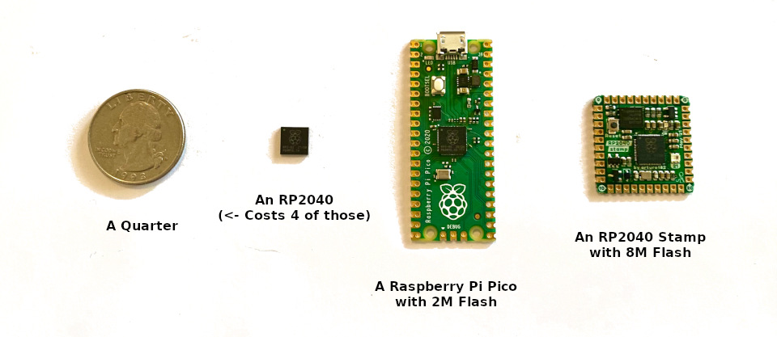

This is part of the series behind the scenes of RP2040 Doom:

* Introduction **<- this part**
* [Rendering And Display Composition](rendering.md) 
* [Making It All Fit In Flash](flash.md)
* [Making It Run Fast And Fit in RAM](speed_and_ram.md)
* [Music And Sound](sound.md)
* [Network Games](networking.md)
* [Development Overview](dev_overview.md)

See [here](https://www.youtube.com/playlist?list=PL-_wCtHUfdDPi7i-4OIy5iQjQ3QSqq1Mh) for some nice videos of
RP2040 Doom in action. The code is [here](https://github.com/kilograham/rp2040-doom).

# The Challenge



Given a new platform it is only natural to think of porting Doom to it. With 264K of RAM, two CortexM0+ CPUs and a 
decent 
clock speed, the RP2040 is certainly not the tightest platform Doom has ever been ported to - although at <$1 it 
is probably one of the cheapest - so I wanted to set my self a more aggressive set of goals:

1. Everything should match the original game experience, i.e. all the graphics at classic 320x200 resolution, stereo 
   sound effects, 
   OPL2 music, save/load, demo playback, cheats, network multiplayer... basically it should feel like the original game.

2. It should run on a Raspberry Pi Pico. This really tightens things up a lot, as there is only 2M of flash for all the 
   code 
   and data. Nevertheless, I decided that all 9 levels of the shareware `DOOM1.WAD` should be playable on the Pico in a 
   single binary. There was to be no sneaky discarding of splash screens, altering of levels, down-sampling of 
   textures or whatever. RP2040 boards with 8M should be able to play at least the full *Ultimate Doom* and *DOOM II* 
   WADs.

3. The RP2040 should output directly to VGA (16 color pins for RGB565 
   along 
   with HSync/VSync) along with stereo sound. Note that the RP2040 itself doesn't have any video or audio hardware, 
   however its PIO (Programmable IO) feature can be used to generate a wide range of digital signals under software 
   control. 

This all immediately presented some fairly obvious problems:

1. The shareware `DOOM1.WAD` is 4M big, so it was going to need it to be decently compressed in order to end 
   up significantly less than 2M, leaving enough space aside for the code/other data along with room for saved games 
   too.

2. VGA output means I would either need to draw the display "just ahead of the beam" at 60fps or to set aside a 
   lot of the RAM for two 320 x 200 x 8-bit frame-buffers for double-buffering.

3. If I took away RAM for the frame-buffers then I would be back with <160K of RAM space which is really, really 
   tight. This means I could not just decompress levels to RAM before they run. Equally, I could not hope to 
   decompress 
   levels to flash either since then there would be even less space for the code/WAD. This means the game would 
   have to 
   work 
   directly 
   off of compressed data in flash at runtime.

4. Wanting to support the original demos means everything has to match _exactly_ with the original game, as the 
   demos are simply a sequence of input events, and the slightest calculation or behavior difference can cause 
   *"desync"* 
   ending up, for example, with the player running into, and shooting at, walls. I hit one such case, trying to save 
   space by reflecting the quarter cycles of the `sin` table instead of storing all of them, and this caused desync 
   even 
   though the errors are at most 1/65536! On the bright side though, the demos turn out to be _really good_ regression tests!

# The Results

Here is a video of the Doom shareware version (`DOOM1.WAD`) running on a Raspberry Pi Pico with VGA and sound 
hooked up via fly-wires:

<div style="position: relative; padding-bottom: 56.19%; clip-path: inset(2px 2px)">
<iframe style="border: 1; top: 0; left: 0; width: 100%; height: 100%; position: absolute;"
 src="https://www.youtube.com/embed/eDVazQVycP4" title="RP2040 Doom on a Raspberry 
Pi Pico" 
frameborder="0" allow="accelerometer; autoplay; clipboard-write; encrypted-media; gyroscope; picture-in-picture" allowfullscreen></iframe>
</div>

See [here](https://www.youtube.com/playlist?list=PL-_wCtHUfdDPi7i-4OIy5iQjQ3QSqq1Mh) for more videos including some 
direct video/audio captures.

Features:

* Full `DOOM1.WAD` playable on Raspberry Pi Pico with 2M flash.
* *Ultimate Doom* and *Doom II* are playable on 8M devices.
* 320x200x60 VGA output (really 1280x1024x60).
* 9 Channel OPL2 Sound at 49716Hz.
* 8 Channel Stereo Sound Effects.
* I2C networking for up to 4 players.
* Save/Load of games.
* All cheats supported.
* Demos from original WADs run correctly.
* USB Keyboard Input support.
* All end scenes, intermissions, help screens etc. supported.
* Good frame rate; generally 30-35+ FPS. 
* Uses 270Mhz overclock (requires flash chip that will run at 135Mhz).

The code can be found on [github](https://github.com/kilograham/rp2040-doom).

# RP2040 Doom Development

Development happened, on and off, in bits of free time over about 6 months, with the rough process being: 

```
while (!convice_myself_its_probably_impossible()) {
    do_some_more();
}
```

At some points the next steps seemed motivation-zappingly hard, leading to a couple of hiatuses. 
That said, I wasn't prepared to be beaten, so I kept coming back!

I had pretty good idea how I hoped things might work from the start, but there was an awful lot of 
everything to fit into flash, so there was always a chance it just wouldn't happen.

Getting everything to work well was quite the adventure, so I figured others might be interested in a dip into how it 
works, problems I faced, and why I did some things the way I did. This is the point of this short "blog" series:

# Section Overview
   
This post is split into a number of distinct sections which are hopefully largely independent, so you can pick 
and choose the ones that interest you. In some cases a part may assume you have some knowledge from another part, 
but if so you can always go off and read that. The ordering of parts is somewhat arbitrary and based on my guess of 
what 
people might find most interesting/unique. 

## Rendering And Display Composition
RP2040 Doom uses a very different rendering order compared to the original "vanilla" Doom, both to allow simultaneous 
rendering by 
both 
cores, but also to avoid decompressing the same source texture columns multiple times per frame.  

Additionally, there is some hard work that goes 
into compositing the final display, dealing with menu overlays and wipe effects, all of which were complicated by the 
fact that there only turned out to be enough RAM for two 320x168 buffers, i.e. the area above the status bar. 
This section also describes how the 320x200 VGA display (actually 1280x1024) is driven.

You can read all about the rendering and display composition [here](rendering.md).

## Making It All Fit In Flash
As mentioned above, getting the whole shareware game to fit in 2M is hard work.  The level data, music and graphics 
are all compressed in novel/custom manners. All compressed level data and graphics must be random-accessible in flash,
as there 
is no 
spare RAM to compress even one level worth of anything.
All in all there are quite a number of interesting and perhaps unusual techniques used to shoe-horn the data into the 
new WHD ("*W*here's *H*alf the *D*ata") format, and they are described in this section.
Additionally, the saved game format had to be shrunk by a factor of about 10x to store saved games in flash too!

You can read all about the compression techniques [here](flash.md).

## Making It Run Fast And Fit in RAM

The RP2040 only has 264K of RAM. A straight RP2040 compile of the Chocolate Doom source code off which RP2040 Doom is 
based requires 300K of static mutable data, and a minimum of about another 700K for dynamic allocation. The math 
clearly 
does 
not add up, so some liposuction would be required.

Additionally, there is little point in doing any of this if the game does not run at a decent frame rate. Getting 
things to run fast enough was also quite a challenge, and sadly the less RAM you have, the slower things are 
likely to be, as code or data are relegated to the slower-to-access flash.

You can read all about the techniques and trade-offs [here](speed_and_ram.md).

## Music And Sound

One of the main sound cards of the day when Doom was the Sound Blaster which had 8-bit sampled audio output along 
with a 9 channel Yamaha YM3812 (OPL2) synthesizer as used on the prior Ad Lib card. Recreating this MIDI/synthesizer 
sound 
really duplicates the mood of the original game, but emulating the OPL2 fast enough to run on a Cortex-M0+ 
microcontroller at all is non-trivial. 
This is even more of a challenge if you want it to consume only a *small* 
fraction of your CPU time, and also use very little RAM. 

This is discussed, along with brief details of the sampled sound effect generation, in the sound section [here](sound.
md).

## Network Games
Microcontrollers have GPIOs, and you can connect them together with wires, so it seemed rude not to implement some 
sort of network game support. RP2040 Doom supports up to four players in regular/deathmatch mulit-player over a two 
wire I2C 
connection.

You can read brief details [here](networking.md).

## Development Overview

I didn't just start with a working source port and expect to compile it for the RP2040 and be immediately able to start 
debugging from there. This section describes the rough process of getting from A to B through intermediate steps, along 
with whatever other miscellaneous items that didn't really fit anywhere else!

You can read more [here](dev_overview.md).

# Credits

* This port is based off the awesome original-dos-doom-experience-focused [chocolate-doom](https://www.
  chocolate-doom.org/wiki/index.
  php/Chocolate_Doom), 
which is itself based off the original Id Linux shareware [source code](https://github.com/id-Software/DOOM). Thanks of course to the original team at Id for starting it all.
* The OPL2 emulation is derived from [emu8950](https://github.com/digital-sound-antiques/emu8950).
* The sound effects are ADPCM compressed using [ADPCM-XQ](https://github.com/dbry/adpcm-xq).
* No code from other minimalist Doom ports is used, however I did borrow the classification of object types that 
  are static decorations from a Doom-on-a-light-bulb port that came out just as I was about to have to do it myself!

---

Read the first section [Rendering And Display Composition](rendering.md) next.
