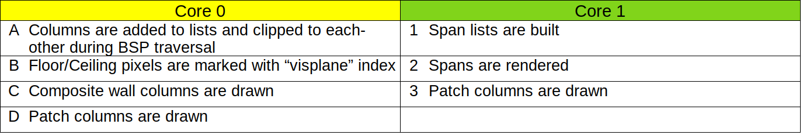
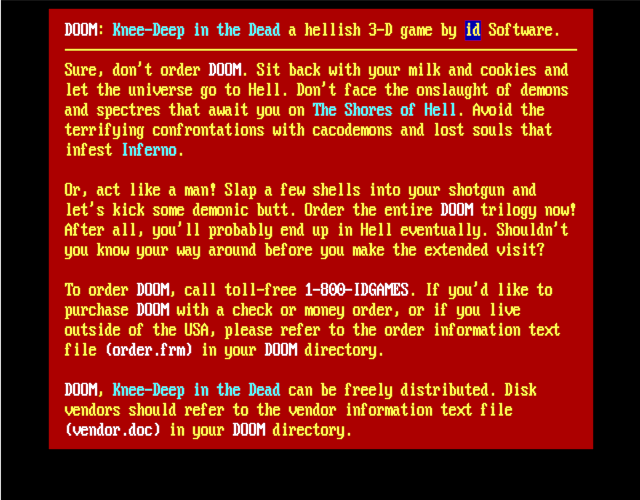
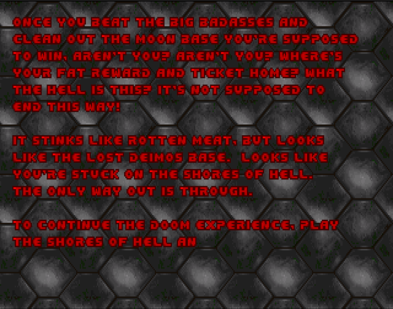

This is part of the series behind the scenes of RP2040 Doom:

* [Introduction](index.md)
* Rendering And Display Composition **<- this part**
* [Making It All Fit In Flash](flash.md)
* [Making It Run Fast And Fit in RAM](speed_and_ram.md)
* [Music And Sound](sound.md)
* [Network Games](networking.md)
* [Development Overview](dev_overview.md)

See [here](https://www.youtube.com/playlist?list=PL-_wCtHUfdDPi7i-4OIy5iQjQ3QSqq1Mh) for some nice videos of 
RP2040 Doom in action. The code is [here](https://github.com/kilograham/rp2040-doom).

# Rendering Introduction

I wanted to drive a VGA signal directly from the RP2040 since VGA is most in spirit with Doom and the '90s.
Driving a VGA signal from the RP2040 really here means driving DPI (16 color pins for RGB 565, a VSYNC pin and an 
HSYNC pin) and then passing the color pins through resistor DACs. Since driving VGA is more demanding time wise, 
and uses more RAM than using an external LCD display, aiming for VGA first made most sense.

An easy way to drive VGA video is to use the `pico_scanvideo` library from the Raspberry Pi
[pico_extras](https://github.com/raspberrypi/pico-extras) repository.
This uses one of the eight PIO state machines to generating timing signals, and another to generate pixel values for 
each scanline (in our case 16-bit 5:6:5 RGB).
The timing state machine wakes up the scanline state machine at the start of every display line. 
The scanline state machine is fed by DMA from main RAM.

The `pico_scanvideo` library manages a small pool of scanline buffers, and hands empty ones to the application to be 
filled "ahead of the beam", i.e. just before the scanline needs to be displayed according to the 60fps monitor 
refresh.
Thus, with `pico_scanvideo`, there is actually no need
to have a frame-buffer at all if you can generate all your rendered content fast enough scanline by scanline every 
frame.

320x200 is the target resolution to match Doom of the time, however this is likely not a mode
commonly supported by modern displays or TVs. I also don't have the luxury of tri-linear filtering
to upscale the image smoothly, so if I wanted to upscale it to a higher resolution I needed to use 
integer multiples of 320x200. The `pico_scanvideo` library can do pixel-doubling, tripling etc. at basically no cost; 
for horizontal scaling the pixel values are just left on the pins for longer (i.e. clocked out slower) to make the 
pixel wider, and for vertical 
scaling the same scanline data is repeated for multiple display lines.

To get the closest approximation to the right aspect ratio, I decided to go with 1280x1024 timing (which works out 
with 4x5 pixels and 
2.4 pixels of black above and below the image) along with a 108Mhz pixel clock. This pixel clock is one of the 
deciding factors in the choice of 270Mhz as the (over)clock for the RP2040. 

# 3D rendering
Back to the rendering; I actually straddled the fence on the "whether to have a frame-buffer" question for a really 
long time 
into development. This really comes down to how I planned to draw the 3D game view:

## Drawing 3D View Using frame-buffers?

- I'd need RAM for two frame-buffers for double-buffering.

- Pixels would be stored as 8-bit palette indexes, matching vanilla Doom's behavior, as there definitely wouldn't be 
  enough
  room for two 320x200x16 frame-buffers (125K each).

- Scanlines would need to be palette converted to 16 bit by software "ahead of the beam".

I was still really worried though about the need for 125K total of frame-buffer even in 8-bit, as this
basically halves the available RAM.

## Drawing 3D View on the fly?

- For the 3D I would have the game loop generate display-lists of screen-covering (and non overlapping) pixel columns 
  and render from display-lists on the fly at 60fps. Note that Doom itself deals with columns of pixels whether they be 
  wall 
  texture columns, 
  columns of a sprite, or regions where a floor/ceiling needs to be drawn.

- I prototyped this using two 320x8 "band buffers' (think old school printer drivers). Because Doom is columnar in its 
  rendering, I'd draw 320 8-pixel-tall columns, overdraw the floors/ceilings within that, and give 8 pixel lines
  to `pico_scanvideo` to display while I moved on to rendering the next 8 pixel band.

- My prototype and calculations showed that I might be able to munge most of the source texture data for any given 
  frame into <64K, and I was hoping to be able to fit that and the metadata needed to manage the 
  columns into less than the size of two frame-buffers. Of course, I'd need to keep source texture data for both 
  current and next frame, along with two frames worth of metadata.
 
  If it worked though, it seemed like it might help with the problem of decompressing textures, since  my "cache" of 
  texture columns would be largely reused from frame to frame as much of the scene content remains the same, so i'd 
  probably save a bunch of time there.

I made the following prototype of this on the fly 60fps rendering, running off canned display-lists. It is running 
concurrently with the music and the game loop:

<iframe style="border: 1; top: 0; left: 0; width: 100%; height: 100%; position: absolute;"
src="https://www.youtube.com/embed/cG7bsLvQKjM" title="Rendering Prototype Video" 
frameborder="0" allow="accelerometer; autoplay; clipboard-write; encrypted-media; gyroscope; picture-in-picture" allowfullscreen></iframe>
    

As promising as this looks, it is using a full 100% of one core for the rendering, and I realized 
i'd probably actually made some mistakes with my numbers meaning that my column caches might not fit, that the 
complication 
factor 
was immense, and so I figured I'd probably best abandon this whole plan in favor of using double frame-buffers instead.

## Column Lists

In the course of prototyping, I had however created an alternate mode of Doom rendering, whereby columns are 
rendered to display-lists rather than drawn directly to the frame-buffer as in vanilla Doom.

Doom itself is quite good at avoiding overdraw, however given that I knew I would need to decompress textures on the 
fly 
every frame, I not only wanted to avoid drawing things which might not be visible, but more importantly
to be able to adjust the draw order so that all columns using the same texture (and indeed all 
screen columns using the same source texture column) could be drawn together, thus decompressing each texture column 
only once 
per frame. Creating a list of columns to be displayed that can be sorted by source texture allows this to happen.

Additionally, the generated display-lists cover the entire display and each pixel exactly once.
This lack of overdraw allows the rendering to occur in any order, and thus to be more easily split 
between 
the 
two cores.

The size of this column list metadata in RP2040 Doom is 3600 columns at 12 bytes each (i.e. 42K) which is a 
non-trivial amount of our RAM, however the use of the column lists actually allows us to remove the oft-maligned 
"visplane" and "drawseg" structures used by vanilla Doom rendering code which 
are themselves about 70K big. 

Unlike vanilla Doom which draws sprites and transparent textures after the scenes is drawn, based on 
clipping regions saved from earlier rendering, RP2040 Doom records, z-sorts and clips all individual columns (floor, 
ceilings, walls, sprites) as the scene is drawn.

This does lead to some subtle rendering differences with vanilla Doom, in the 
"invalid" cases where 2D sprites pass through 3D walls, but the results are not noticeable during game play (at least 
to me).

### Column lists generation

This process happens during the scene (BSP) traversal, which is when vanilla Doom would be rendering walls, ceilings 
and 
floors to the frame-buffer as well.

As solid columns are generated, they are allocated a slot in the `render_cols` array, and inserted into one of 320 
linked lists. Each linked list is of non-overlapping columns for each screen x-position, sorted by 
y-position. At the 
end of rendering, each column is fully covered, as this is vanilla Doom behavior: the entire scene should 
always be drawn which avoids the need to clear the screen first.

As mentioned above, depth information for each column is used to clip columns against each other within their list,
discarding or splitting as necessary. For performance, the algorithm supports inserting a sorted set of 
column 
segments into the sorted list in one pass, which is efficient for sprites or transparent textures, which may 
generate multiple solid column segments at the same on-screen x-position.

A separate linked list is kept for each x-position for the "fuzzy" (shimmering invisibility) columns, since they 
behave 
differently w.r.t. clipping, and the insertion/clipping code path is too hot to be dealing with a bunch of alternative
code paths based on the column type.

### Rendering to the frame-buffer from the column lists

When the 3D scene has been fully rendered into the column lists, that list is then used to render the screen
as soon as one of the frame-buffers is freed up by the display.

The initial steps of rendering are done on core 0 only:

* On core 0, all "fuzzy" columns (shimmering invisibility) for each x-position are clipped to the final opaque columns 
  for 
   that x-position. This must be done early, as the regular column display-lists are destroyed during rendering, but 
  the fuzzy columns are not drawn until the end. 

* On core 0, each floor or ceiling column is drawn to the frame-buffer using the color 
   equal to  its "visplane" index. The "visplane" 
   index uniquely identifies the floor/ceiling texture used ("flat" in Doom parlance), light level and height in 3D space 
  within the 
   frame. Any horizontal strip of pixels with the same "visplane" index can be drawn in a single, fast 
   rendering operation later.

  Note that an extra 9th bit of frame-buffer here is used to disambiguate these "visplane" 
  index 
  values in 
  the 
   frame-buffer from actual rendered pixel values. The floor/ceiling columns are unlinked from their original linked 
   lists at this time, and added to a single "free list" because the freed up space needs to be reused 
  later in the 
  rendering.

Now rendering proceeds with both cores:

* Core 1 builds new horizontal span lists for each "visplane" index by scanning the 9-bit frame-buffer horizontally 
   for runs marked with the same "visplane" index value. These new "span" list elements are 6 bytes big, and fit two 
  per 
  slot in 
  the old
   freed up floor/ceiling column entries.
 
  When the scene scan is complete, or the free slot list is
   exhausted,
   the gathered horizontal spans are rendered. Since separate span link-lists are kept per "visplane" index, all 
  the spans for
   one "visplane" index are rendered, then all the spans for the next, etc. This order is additionally optimized such 
  that all the "visplane" indexes that share the same texture ("flat") are drawn together. This way the 64x64 "flat" 
  texture only has to be decompressed once per frame. 
  
  Dealing with all the spans for one flat at a time certainly helps, but additionally, 
   a cache of
   these decoded flats is kept that grows downward from the top of the 42K display-list area, so that some flat 
  decoding can 
  often be 
  skipped
   from
   frame to frame when the number of columns is lower than the max. Flats that are already in the cache are
   preferentially rendered first to avoid evicting flats from the cache when they are about to be usable. 

* At the same time, core 0 starts rendering "composite" columns. These are texture columns made from more than one 
  source graphic
   ("patch") composited on top of each other. Many texture columns have only one patch but these are not considered
   "composite". Decoding and rendering these composite columns takes more RAM work area than
   can be afforded in both cores, so is done exclusively on core 0. Note than unlike in vanilla Doom rendering, the
   composite column pixels are not calculated until they are actually needed for an onscreen visible column. There
   is no room to cache them, so this is the cheapest place to do it.

* As soon as they are done with other work, both core 0 and core 1 continue rendering all the columns for the remaining 
  graphics (patches). These are either sprite columns or single-patch wall columns. Each core just removes a patch 
  from the queue of remaining patches to be drawn, and then renders all the columns for that patch, until the queue is 
  exhausted.
   
* Finally, on core 0, any (already clipped) fuzzy columns are drawn over the top of the scene.

This is a movie of vanilla Doom rendering. Yellow is used for all the drawing as it is all performed by a single 
thread of execution. The walls, floors and ceilings are drawn during scene (BSP) traversal, then the sprites are drawn 
on top. This 
would be 
true even if they were 
clipped by walls closer to the viewer, as vanilla Doom keeps the expensive `drawseg` structure to record which parts 
of which sprites are clipped.

<iframe style="border: 1; top: 0; left: 0; width: 100%; height: 100%; position: absolute;"
src="https://www.youtube.com/embed/20bBYqDNqVs?playlist=20bBYqDNqVs&loop=1" 
title="Vanilla Doom Rendering Video" 
frameborder="0" allow="accelerometer; autoplay; clipboard-write; encrypted-media; gyroscope; picture-in-picture" allowfullscreen></iframe>

This is a movie of RP2040 Doom rendering of the same scene. This simple scene does not include any fuzzy columns, so
these are the pertinent steps:

<iframe style="border: 1; top: 0; left: 0; width: 100%; height: 100%; position: absolute;"
 src="https://www.youtube.com/embed/2OIo32F2eKY?
playlist=2OIo32F2eKY&loop=1" title="3D Rendering Video" 
frameborder="0" allow="accelerometer; autoplay; clipboard-write; encrypted-media; gyroscope; picture-in-picture" allowfullscreen></iframe>
    

</svg>

# Generating the rest of the display

Thus far, I've talked exclusively about the 3D rendering, which in the fixed display layout chosen occupies the 
top 
320x168 of the screen (with the status bar covering the 32 pixels below that).

I realized that I didn't have enough RAM for the extra 10K per frame-buffer for the last 32 lines, so each 
frame-buffer is 
indeed only 320x168 big. So what about the bottom 32 pixels?

## Double-Buffered Mode

The only time the full double-buffering is actually used is for the 3D rendered game play, i.e. not during splash 
or  intermission screens. When the 3D view is shown on screen, the status bar is always shown at the 
bottom, 
and since there is no backing frame-buffer for it, this has to be drawn "ahead of the beam".

In the Doom code, the status bar (and the menus etc) are all drawn using rectangular graphics (patches) using `V_Patch` 
functions. I therefore call these graphics "V-patches". In vanilla Doom, these `V_Patch` calls draw 
the 
patches 
directly onto a 
frame-buffer, however in RP2040 Doom, these functions record the V-patches and their coordinates into 
display-lists instead. 

A complete V-patch display-list can either then be rendered in 8-bit on top of the current rendering frame-buffer, 
or it 
can be passed to the display code as an "overlay" for the next-frame.

In the overlay case, the V-patches will be drawn line by line just ahead of the beam into the scanline buffers as 
needed. To achieve this, the "overlay" display-list is sorted into a set of V-patches that either 
start or 
end on each scanline, and that list is used 
to maintain a list of active V-patches as the beam works scanline by scanline down the screen. A horizontal strip of 
each
active V-patch is drawn in 16-bit directly into the scanline buffer on top of the just-8-to-16-bit-converted 
frame-buffer data for that scanline.

In this way the "overlay" V-patch display-list graphics appear in front of the frame-buffer content. In 3D mode 
the status 
bar 
always forms part of the overlay, and since the status bar is always opaque you never notice that there is no 
frame-buffer behind it!

Note that in double-buffered mode, menus are drawn onto the frame-buffer as part of per-game-frame rendering, as 
any changes in the menu can be redrawn on the next frame anyway, and it is cheaper than doing the whole menu as an 
"overlay".

The `whd_gen`tool used to convert WADs for use by RP2040 Doom, converts V-patches into a custom format suitable for 
efficient rendering as horizontal strips, as this needs to be super fast when drawing overlays ahead of the beam at 
60fps.

The following movie shows typical double-buffered rendering with the menu showing; the menu is drawn into the 
frame-buffer, but the status bar is drawn in the overlay. In this example each Doom frame is rendered over the course
of two (60fps) display frames although in practice it often only takes one. Note that the overlay display-lists are 
double-buffered too.

<iframe style="border: 1; top: 0; left: 0; width: 100%; height: 100%; position: absolute;"
 src="https://www.youtube.com/embed/ZG-Ejzd9VlU?
playlist=ZG-Ejzd9VlU&loop=1" title="Double-Buffered Mode Video" 
frameborder="0" allow="accelerometer; autoplay; clipboard-write; encrypted-media; gyroscope; picture-in-picture" allowfullscreen></iframe>
    

Note that the pause after the display is refreshed every 1/60th of a second represents the vertical retrace/blanking 
time.

You will also notice that the palette changing effects (e.g. red "blood" when hurt) are not applied until 
conversion to 
RGB565 when generating the scanline buffers.

## Single-buffered Mode

Some screens, e.g. splash screens, and between level intermissions, are the full 320x200. In this case an individual 
320x168 frame-buffer is 
not 
large enough, so I use one frame-buffer for the 
top 168 pixels and the bottom 32 pixels of the other frame-buffer for the rest. 

In this mode I cannot double-buffer 
as there isn't room for two full copies of the screen.
Therefore, menus and any other changing graphics are drawn in the overlay layer (as V-patch display-lists), as 
their content may need to change, but there is also no off-screen frame-buffer on which to safely redraw.

The follow movie shows an intermission screen with all the foreground changeable content, drawn as overlays via 
V-Patch display-lists:

<iframe style="border: 1; top: 0; left: 0; width: 100%; height: 100%; position: absolute;"
 src="https://www.youtube.com/embed/XXmrbuuv5FE?
playlist=XXmrbuuv5FE&loop=1" title="Single-Buffered Mode Video" 
frameborder="0" allow="accelerometer; autoplay; clipboard-write; encrypted-media; gyroscope; picture-in-picture" allowfullscreen></iframe>
    

## Wipe Effect

The wipe effect starts to get tricky, as theoretically you are wiping between two 320x200 screens. Fortunately this is 
something of an illusion, and with care you can limit the displayed-at-any-time real estate to fall within 168 * 2 
pixel heights worth of frame-buffers (which is 1.68 * 200, so just about one and two-thirds times a full screen 
instead of two).

It is the responsibility of the scanline buffer generation code to select pixels from one of the two screens based 
on the current wipe offsets, in other words, unlike vanilla Doom, the result of the wipe is never actually 
realized 
in a full 
frame-buffer.

To see how a wipe between two screens is performed using only 1.68 frame-buffers, here is an example of
transitioning from one *Game A* (e.g. demo playback), to a new *Game B*.

1. We start in double-buffered mode. *Game A 3D View* is in displayed from frame-buffer 0, *Status Bar A* is displayed 
   as an 
   overlay.

2. The top of the *Game B 3D View* is rendered onto the top 136 pixels of frame-buffer 1, *Status Bar A* is drawn on to 
   the bottom 32 pixels of frame-buffer 1. At this point we are in single-buffered mode using 
   frame-buffer 0 and the bottom of frame-buffer 1 for the last 32 pixels. Note that a wipe is always effectively 
   from one pre-wipe single-buffered screen to another post-wipe single-buffered screen.

3. We can now start wiping between the pre-wipe view and the top of the post-wipe view. At this point we have all 200 
   pixels of 
   the pre-wipe screen and the top 136 pixels of the post-wipe screen available.

4. About half-way down, the bottom of the *Game B 3D View* is rendered on to the bottom of frame-buffer 1 as *Satus 
   Bar A*
   has now slid off the bottom of the display. At this point we now have the top 168 pixels of the pre-wipe screen and 
   the top 168 
   pixels of the 
   post-wipe screen available.

5. A little further-down, the *Game B Status Bar* is drawn onto the bottom of frame-buffer 0 where the bottom 32 pixels 
   of the *Game A 3D View* (also now off the bottom of the display) used to be. At this point we now have the top 136 
   pixels of the pre-wipe 
   screen and all 200 pixels of the post-wipe screen available.

6. When we finish the wipe, we are effectively in single-buffered mode using frame-buffer 1 and the bottom of 
   frame-buffer 0 for the last 32 pixels.

7. Finally, we re-enter double-buffer mode, with *Game B 3D View* displayed from frame-buffer 1 and *Status 
   Bar B* 
   displayed as an 
   overlay.

<iframe style="border: 1; top: 0; left: 0; width: 100%; height: 100%; position: absolute; clip-path: inset(2px 2px)"
 src="https://www.youtube.com/embed/eGUleOBiWZU?
playlist=eGUleOBiWZU&loop=1" title="Wipe Effect Video" 
frameborder="0" allow="accelerometer; autoplay; clipboard-write; encrypted-media; gyroscope; picture-in-picture" allowfullscreen></iframe>
    

Note that the overlay display-lists are mostly empty in this sequence, but would contain V-Patches for the menu if 
it was displayed during the wipe.

Here is a sped-up version of the above:

<iframe style="border: 1; top: 0; left: 0; width: 100%; height: 100%; position: absolute; clip-path: inset(2px 2px)"
 src="https://www.youtube.com/embed/BXDIc_z6pFI?
playlist=BXDIc_z6pFI&loop=1" title="Wipe Effect Video" 
frameborder="0" allow="accelerometer; autoplay; clipboard-write; encrypted-media; gyroscope; picture-in-picture" allowfullscreen></iframe>
    

## Text Mode

Adding a text mode was perhaps overkill in retrospect, but initially I thought I would need it for the network game 
setup, and it was a nice, fun, brief distraction when I got a bit bogged down in the WAD compression.

Changing display timings on the fly is a bit of a hassle, so I use the same 1280x1024 timing, but this time for
a 640x400 mode (80x25 with 8x16 glyphs).

I used an alternate loop in the PIO scanline program to render the raw data at only 2x horizontal pixel stretching, 
resulting in 640 horizontal pixels, but dealing with the vertical stretching is more difficult. I really want to 
stretch vertically  by a factor of 2.5, 
however this cannot be 
done exactly.
Instead, I
leave `pico_scanvideo` at 200 logical lines, but take advantage of another of its features to render multiple 
actual scanlines within the logical line. One scanline buffer is used for the first 2 timing scanlines, and a different 
one is 
used 
for 
the remaining 3, totaling the 5 timing scanlines per logical screen line. 

Given the DOS-y font, you would be hard 
pushed to 
tell 
 that 
every other 
scanline is 0.8x or 1.2x as 
big as it should be:  

Since, I had the text mode, I added a little DOS shell easter egg which is a good way to check the size of your 
saved games!

## End Sequences

When certain levels or the entire game is completed in Doom, special end sequences are shown. These have special 
rendering code in vanilla Doom, and must also be handled specially in RP2040 Doom.

### "Typed Message" End Screens

These are single-buffered screens which actually have a single, tiled, floor/ceiling "flat" texture
as the background. Since there is a lot of text, and it is not modified once drawn, the text directly is drawn 
directly onto the single buffer, character by character, as V-patches as the text is "typed".

### "Bunny" End Screen

The end scene of *Doom I* has a 640x200 image which is slowly scrolled horizontally. I want to treat this just like a 
regular 
single-buffered 320x200 screen (with menus and other V-patch overlays), but need to be able to scroll it without 
tearing. For simplicity, the task of performing the scroll is given to the scanline buffer filling code, which can 
perform 
the task at the right time to avoid tearing...

Every time (frame) when the screen must be scrolled, a new one pixel wide 
vertical strip of graphic to be 
scrolled on is decompressed. This is made available to the display code for the next frame, 
and the scanline rendering code for each row `memcpy`s that row of the frame-buffer(s) one pixel to the left, adds the 
one new scrolled on pixel for that row, and then converts that strip of 320 8-bit pixels to 16-bit in the new 
scanline buffer. 

In practice, there are actually two pixel wide strip buffers, because any time data is passed to the display 
code which is asynchronous with the rest of the game code, double-buffering of some sort must be used.

<iframe style="border: 1; top: 0; left: 0; width: 100%; height: 100%; position: absolute;" src="https://www.youtube.
com/embed/eveHe0MR1hY" title="Bunny Sequence Video" 
frameborder="0" allow="accelerometer; autoplay; clipboard-write; encrypted-media; gyroscope; picture-in-picture" allowfullscreen></iframe>
    

 
Note the frame rate indicator in the top right; this is available/toggled in RP2040 Doom by pressing the `\` key. 
The "THE END" graphics are rendered as V-Patch overlays.

### "Doom Cast" End Screen

The *Doom II* finale shows a cast of characters, with each player and monster type animating over a 320x200 background.
This is fine for vanilla Doom because patches are patches as far as it is concerned. In RP2040 Doom however, regular 
sprites
are stored as compressed columnar data, but I need V-patches (stored as horizontal strips) if I want to draw 
something as an overlay
over a single-buffered background.

I didn't want to be storing all of the (many) sprite frames used in multiple formats in the WAD, so I had to be able to 
work with our existing compressed, columnar patch data.

Some of these sprites are very big (maxing out at about 257x135) so there is not enough RAM to convert two frames 
worth, for double-buffering, into our V-patch format. What I did notice, however, is that 135 is conveniently one less 
than 
the amount of frame-buffer height left unused in single-buffer mode (the top `168 - 32 = 136` of the second 
buffer).

Therefore, the best option is to render the appropriate part of background bitmap to this buffer, 
draw the 
sprite over the 
top, and then `memcpy` this 320x136 region to the 
active frame-buffer soon enough after the VSYNC to avoid tearing.
Fortunately this can reuse majority of the regular sprite->column list->frame-buffer path used  by regular rendering 
in the game.

The good news is that, whilst simple, this all works like a charm!

<iframe style="border: 1; top: 0; left: 0; width: 100%; height: 100%; position: absolute;" src="https://www.youtube.com/embed/Nkeqa40ci8I" title="Cast End Screen Video" 
frameborder="0" 
allow="accelerometer; autoplay; clipboard-write; encrypted-media; gyroscope; picture-in-picture" allowfullscreen></iframe>
    

# Miscellaneous

* Because I sometimes need to hoist menus from being drawn on the frame-buffer to being drawn via the "overlay" 
  display-lists, I sometimes have to get the game loop to run one more time before the game changes state (e.g. 
  before a wipe).

* Additionally, during wipes, different parts of the same frame must be drawn at different times, which is 
  a problem, as the column-lists generated by the scene rendering are destroyed during rendering. Therefore, 
  when 
  redrawing a new section of the screen, the code has to back out further into 
  the main Doom code, and re-render the scene from scratch.

* Much of this code to handle all this is ugly!

* Rendering of the status bar is *extremely* time constrained. The background graphic is too large to keep in RAM, 
  but all 5K (320x16x4-bit) of it is needed every frame. The RP2040 has a convenient low priority DMA mechanism to 
  stream data from the flash when XIP accesses are not happening, This is great as it does not pollute the XIP cache,
  and can happen concurrently with everything else we are doing. However, due to the tight timing and unpredictable 
  nature of the XIP cache usage by other code, this DMA may or may not be complete by the time the pixel values are 
  needed.

  Therefore, the rendering for the status bar V-Patch is handled specially, and it works concurrently 
  with the still in progress DMA, stopping when it reaches the end of what has been DMAed, handling the rest 
  normally. In this fashion the status bar scanline is rendered just in time.

---

Read the next section [Making It All Fit In Flash](flash.md), or go back to the [Introduction](index.md).
