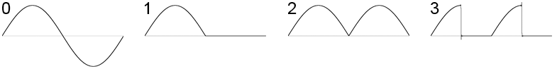

This is part of the series behind the scenes of RP2040 Doom:

* [Introduction](index.md)
* [Rendering And Display Composition](rendering.md)
* [Making It All Fit In Flash](flash.md)
* [Making It Run Fast And Fit in RAM](speed_and_ram.md)
* Music And Sound **<- this part**
* [Network Games](networking.md)
* [Development Overview](dev_overview.md)

See [here](https://www.youtube.com/playlist?list=PL-_wCtHUfdDPi7i-4OIy5iQjQ3QSqq1Mh) for some nice videos of
RP2040 Doom in action, including the sound.

Find me on [twitter](https://twitter.com/kilograham5).

# Sound Introduction

RP2040 Doom attempts to recreate the sound feel of the original Doom game in the '90s.  

One of the main sound cards of the day was the Sound Blaster which had 8-bit sampled audio output along
with a 9-channel Yamaha YM3812 (OPL2) synthesizer as used on the prior Ad Lib card. Another popular card at the 
time the original Doom was release was the Gravis UltraSound. The latter however used samples for MIDI synthesis, 
and 
RP2040 Doom does not have RAM or flash space for the samples, so OPL2 synthesis it is!

The OPL2 chip generates samples
at the frequency of 49,716Hz. Other Doom ports may choose to perform down-sampling to other more common frequencies,
or perhaps even generate OPL2 samples at a lower frequency, but as the RP2040 can output sound at any frequency I want,
I chose to use 49,716Hz as the 
actual audio output frequency with no resampling for simplicity.

Audio is output in 16-bit stereo over I2S using one of the RP2040's PIO state machines to encode the output based on 
raw signed 16-bit samples fed via DMA. Using 8-bit PWM would be equally trivial, but - perhaps incongruously given 
the 8-bit nature of the time - I figured that 16-bits sound is preferable, and in either case you need some 
sort of 
external 
circuitry. I2S->analogue chips are common and cheap,  and whilst the RP2040 can certainly produce PWM sound much 
better than 8-bit, it starts to take a bit more effort! 

# Sound Effect Generation

Doom sound effects are 8-bit mono samples, generally, though not necessarily, at 11,025Hz. RP2040 Doom supports 8 
channels (which is what vanilla Doom supports) and each channel has volume/pan settings to map onto the stereo output.

Samples are frequency-converted by simple fixed point 16:16 fractional stepping through the sample data, and mixed 
according to their volume/pan settings into the final 16-bit stereo values.

In order to make RP2040 Doom fit on a Raspberry Pi Pico, the sound effects needed to be compressed, and this is done 
using ADPCM using the [ADPCM-XQ](https://github.com/dbry/adpcm-xq) library. This ends up with 4-bits per sample but 
largely imperceptible quality loss. Actually, I believe the SoundBlaster of the day may also have stored samples in 
4-bits using ADPCM, so maybe this is somewhat historically accurate!

For the best speed on a Cortex M0+, it is very important to keep loops tight, keep everything in registers 
and avoid 
function calls within tight loops. The RP2040 has very fast RAM access, with loads/stores being 2 cycles, and bulk 
loads/stores shaving more off that. It therefore tends to be much more efficient to do everything for a single 
channel first, then everything for the next channel, even if doing some means writing samples to a temporary buffer, 
rather than 
attempting to do 
everything for a single sample across all channels before moving onto the next sample.

The sound code runs an optimized tight loop for each channel, updating the 16:16 fractional
sample position, loading the next 8-bit sample, applying volume/pan multipliers,
and adding the value, with clamping, into the final 16-bit stereo 1024 sample output buffer. Note that 1024 is a 
completely arbitrary buffer size, that I chose early on, and never found a reason to change! As a result a new 
sound buffer must be generated on average about every 2ms.

The 8-bit samples obviously have to come from the ADPCM compressed data. Again, for speed on a Cortex-M0+ it is better 
to not mix concerns, so a small 8-bit buffer of decompressed samples is kept for each of the 8 channels. The buffer 
size is 249, as this is the size of the ADPCM block being used. When a channel reaches the end of the decompressed 
buffer, 
which at 11,025Hz is after 2.2ms, the tight loop pauses, and the ADPCM decoder is called to decompress another 249 
samples of data.

I did try some low-pass filtering of the samples after their upscale from 11,025Hz to 4,9716Hz, which is really not 
that 
expensive on the RP2040, but didn't produce any noticeable (to me) improvement.

# OPL2

The OPL2 (Yamaha YM3812) is a music synthesizer supporting 9 normal melodic channels as well as noise based percussion 
sounds. You can read more about it on Wikpedia [here](https://en.wikipedia.org/wiki/Yamaha_OPL#OPL). 

Synthesis proceeds as follows:

### 18 Oscillators

Each oscillator starts with a waveform at a particular frequency; the following waveforms are 
supported:



The wave amplitude is controlled with an [ADSR envelope](https://en.wikipedia.org/wiki/Envelope_(music)), which 
models the volume changes as a note is pressed, held and released. Each oscillator also supports tremelo and vibrato.

### 9 Melodic Channels

Each of the 9 melodic channels is formed by combining up to two oscillators, as follows:

1. A single oscillator output can be used.
2. The oscillator outputs may be added together (AM).
3. One oscillator output can be used to modulate the frequency of the other oscillator (FM).

### Percussion Channels

The YM3812 supports a percussion mode where digital bits from 3 of the oscillators are combined to produce 5 
percussion channels. This is actually quite complex, and I was very pleased to discover after a while, that Doom 
does not use them, and so they can be ignored completely! I do not implement them, saving valuable CPU time.

## OPL2 emulation

I tried a variety of different OPL2 emulators both hooked into Chocolate Doom on my PC, but also playing individual 
songs on the RP2040, where I didn't yet have a full working Doom build.

### Picking a codebase to work from
Chocolate Doom uses the [Nuked OPL3 Emulator](https://github.com/nukeykt/Nuked-OPL3). This was the first one I 
 tried, however even running at the final 270Mhz overclock used for RP2040 Doom, this takes 300% of the CPU time on 
 one core. I took a look at the code, decided I had no idea what was going on, and decided to go in search of 
another OPL2 emulator. In retrospect, looking at the code now, this code might have been as good a starting point as 
my final choice, but I didn't realize that at the time.

I next looked at the [Woody](https://github.com/rofl0r/woody-opl) OPL2 emulator that originated in DOSBox. This 
looked a little more comprehensible, and 
seemed to do work more linearly per oscillator, rather than doing everything across the board one sample at a time 
like Nuked OPL3 does. Sadly, the Woody emulator uses floating point, and RP2040 has no hardware floating point support. 
I spent a while converting the floating point to fixed point, which seemed to be promising for a while, but soon turned 
into a quagmire.

Around that time, I read some more about the OPL2 internals, and realized that the real chip produced its output using 
simple integer math with no multiplies via canny use of logarithms and lookup tables. This made my attempts to force a 
natively floating 
point "Woody" emulator 
into fixed point look particularly stupid. Therefore, I 
searched again, and found  [emu8950](https://github.
com/digital-sound-antiques/emu8950), which seemed a lot more comprehensible given my new understanding, and decided 
to try work from there.

### Optimizing the code

I had my choice of OPL2 emulator, but emu8950 was still too slow to run on the RP2040, using 
considerably more than 100% of one overclocked core. I wanted to be able to treat the OPL2 generation almost as 
background noise 
(sorry)
in terms 
of CPU usage, so I needed to speed things up a lot.

The original emu8950 code has a function call to generate a sample that loops over all the 
channels, calling functions to generate the oscillator outputs for that time point. These functions then call more 
functions to generate the sine wave, apply the envelope, advance the envelope etc. All in all, it is a whole tree of 
function calls per sample, which is fine on a fast PC, but not good on a Cortex M0+ where the overhead of a function 
call is generally 30-40 cycles, with the corresponding loss of most of your precious "in-register" state. 

Therefore, RP2040 Doom turns the code *inside out*. The innermost loops are for generating the sample values for 
a single oscillator into a buffer, and then buffers for the different oscillators are combined and so on. This is a 
fundamental 
shift in the implementation of emu8950, so was implemented as an alternative via `#ifdef`  and then 
thoroughly tested by diffing textual output of every oscillator for every sample between the two versions of the code.

Further optimization work was then performed, still not yet moving to the RP2040 itself.

* Unlike the original code, and other OPL2 emulators, which tend to just mirror all the actual hardware does every 
  cycle, my implementation performs no work for any unused oscillators, channels etc.

* Obviously temporary buffer use is minimized. If a channel uses only a single oscillator, then a temporary 
  buffer is not 
  needed 
  and 
  the output is written directly to the channel output buffer. Similarly, the inner loop for the second oscillator 
  also performs the AM or FM modulation with the results of the first, as this can all be done neatly without 
  spilling out of CPU registers.

* Unused OPL2 features were removed. This included the percussion support as mentioned above, along with timer 
  features which the Doom code doesn't use either.
  
At this point, with everything sample accurate, it was time to really dive in with optimizations, so that OPL2 
generation could be something that could be forgotten about even on the RP2040 device.

* Since my new code was small, I decided to move the inner loops to RAM on the RP2040 device, meaning they 
  would never suffer from stalls needed to load fetch code from flash.

* I moved the key lookup tables to RAM also. Initially, these were still inconveniently large, however I was able to 
  make a nice optimization; if you recall the 
  different waveforms from the top of this section:
 
  

  it is pretty obvious that you only really need to store one quarter of a sine cycle, instead of the entirety of 
  each waveform as emu8950 does. The problem then however is that you need to check which quarter cycle you are in, 
  and reflect horizontally, vertically, or set to 0 as appropriate.  This is *way* too expensive to do for every 
  cycle of every oscillator. But there is a satisfying trick I could perform due to the way the that the 
  real OPL2 hardware and emu8950 work. The actual wave forms are represented internally as 15-bit logarithmic 
  attenuation values, along with a negation bit:
  * `0bx000 0000 0000 0000` is unattenuated (i.e. full volume)
  * `0bx111 1111 1111 1111` is fully attenuated (i.e. silent)
  * `0b1xxx xxxx xxxx xxxx` is negated
  * `0b0xxx xxxx xxxx xxxx` is un-negated
  
  Therefore, I was able to get away with storing just one half cycle of the sine waveform, and then getting the 
  negation by 
  OR-ing the input value with `0x8000` or the clamping to zero by OR-ing the input value with `0x7fff`. These `OR` 
  values can be stored in a lookup table indexed by higher bits in the sample position, and thus the 8x space 
  savings can be realized without needing any branches in the code!

* I made heavy use of the RP2040's interpolators. These are simple but powerful single cycle calculators that 
  can 
  be used to optimize shifting, masking and lookups. In addition to being fast, their use frees up scarce 
  Cortex-M0+ registers for use by other code.

* Finally, the entire oscillator generation and oscillator->channel combination was entirely rewritten in assembly code.
  
  1. Small assembler macros could be used to compose the multiple different oscillator output and 
     combination code paths out of some common building blocks.

  2. The entirety of the generation of run of samples for an oscillator could fit with all variables in 
     CPU registers.
  
  3. Use of assembler allowed for some cheeky code flow. Particularly, my original optimized C++ code would separate 
     the 
     oscillator 
     generation in a single function which handles the ADSR envelope. That function uses  
     custom loops for each stage of the envelope:

     ```
     while (phase==attack) { 
        inline_code_to_adjust_envelope_for_attack_phase; 
        int sample = sample_generator[current_mode](current_envelope);
     }
     while (phase==decay) { 
        inline_code_to_adjust_envelope_for_decay_phase;
        int sample = sample_generator[current_mode](current_envelope);
     }
     // .. and so on
     ```
     Each loop requires a function call, a function return, a loop-condition check and a loop branch
     
     In the assembly version, there is a single ADSR function still, but each phase looks like:
  
     ```
     some_hi_register1=start_attack_phase_loop
     some_hi_register2=end_attack_phase
     start_attack_phase_loop:
        inline_code_to_adjust_envelope_for_attack_phase 
        jmp sample_generator[current_mode]
     end_attack_phase:
     ...
     ```
     the `sample_generator` implementation contains the loop-condition check and branch instead, and branches directly 
     back to 
     the 
     start of the 
     loop in a faster, mobius-like control flow. If the loop is complete, a branch is made back out to the end of 
     the phase in 
     the calling function. There is no marshalling of 
     arguments to the `sample_generator` 
     "function" and all state is maintained in registers. 

# The result

The result of all the hard optimization work is that our OPL2 generation of 1024 samples for up to 9 channels takes 
anywhere between about 1.5ms and 4.5ms, averaging around 2ms.  

In other words, we use just 5%-20% of one overclocked core, which is really great, and about a 30x speed improvement 
from where it all started!

---

Read the next section [Network Games](networking.md), or go back to the [Introduction](index.md).