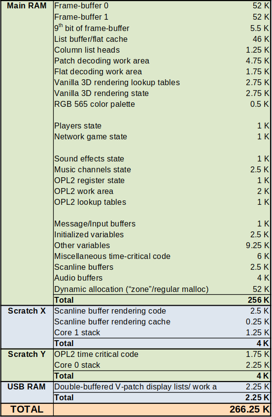

This is part of the series behind the scenes of RP2040 Doom:

* [Introduction](index.md)
* [Rendering And Display Composition](rendering.md)
* [Making It All Fit In Flash](flash.md)
* Making It Run Fast And Fit in RAM **<- this part**
* [Music And Sound](sound.md)
* [Network Games](networking.md)
* [Development Overview](dev_overview.md)

See [here](https://www.youtube.com/playlist?list=PL-_wCtHUfdDPi7i-4OIy5iQjQ3QSqq1Mh) for some nice videos of
RP2040 Doom in action. The code is [here](https://github.com/kilograham/rp2040-doom).

Find me on [twitter](https://twitter.com/kilograham5).

# Overview

Getting Doom to run in our 264K of RAM is hard work anyway, but there are trade-offs with speed to consider too:

### Moving code to RAM speeds things up
The 
flash on the 
RP2040 is mapped into the address space via XIP (eXecute In Place), and bus reads within the flash window can 
be translated into (Q)SPI communication with the flash chip to fetch the data. This type of access is much slower than 
a regular RAM read. To improve things a little, the RP2040 has a 16K RAM cache in front of the XIP mechanism, which 
can avoid the slow read for addresses/data already in the cache. This does help tremendously for relatively small hot 
code or 
data, however given 
that RP2040 Doom is accessing large amounts of level data and graphics from flash every frame, there is likely a lot of 
churn. 

I did consider 
fine control of which data may be cached or not, however I have found this to be hard in general, and often 
counter-productive, given that you often end up not caching code/data that might actually have helped.

Note that the RP2040 XIP cache can be turned off altogether, conjuring another 16K of usable RAM, however RP2040 Doom 
has all its
level
data, graphics, many lookup tables, and most of our code in flash, so there is no clear 16K worth of code/data in 
flash that should be promoted to RAM at the definite cost of *all* other flash access *definitely* being slow.

Given the above, I decided to leave the XIP cache to do its thing, and select a few small areas of hot code 
or data to promote to RAM manually. Basically my strategy here was:

* Include in RAM any timing-sensitive code sections which cannot afford the potential jitter caused by unpredictable 
  XIP 
  cache misses. This is 
  mainly the scanline buffer rendering code, along with the audio and video related IRQ handlers.

* Include in RAM the inner loops and lookup tables of OPL2 synthesizer emulation... after the hard work described in 
  [the section on sound](sound.md), the code and data fits in about 4K. This code and data which is clearly always 
  needed (I don't like to 
  turn the music off!) seemed like the most delineable choice, and making the new heavily optimized code run from RAM 
  meant that I was pretty much able to forget about the cost of music generation from then on.

* Include in RAM any other small lookup tables that are heavily used, for example the palette which is used for every 
  pixel!

### Moving data to flash to save RAM slows things down

Whilst vanilla Doom loads level data for the current level into RAM, we do not have the space to do so. It isn't 
just the level data though, as we have to move other lookup tables and game data structures into flash also
to make enough space for definitely mutable data in our limited RAM.

RP2040 Doom necessarily takes a performance hit for this, which it must make up in other places. Fortunately the CPU 
clock frequency is high compared to the machiness of the day, so the net effect does not seem to be too bad as long 
as these penalties are limited to code that does not run many thousands of time per frame.

### Compressed data has a decoding overhead

As mentioned in the [previous section](flash.md), the level data and graphics are all compressed in flash. This 
again costs us extra instructions to decode them, however the hope at least, is that the reduced XIP cache churn, and 
the fewer actual accesses to the flash due to the smaller working set size, do at least offset this a little.

Note that there is not generally space in RAM for any caches of decompressed data, so it *is* super important 
that the compressed data be decompressible with minimal overhead.

# Use of the two cores

The RP2040 has two symmetric Cortex-M0+ processors. RP2040 Doom splits the work as follows:

### Core 0 - "Game loop"

The main thread of execution on core 0 runs the main game loop, very much as vanilla Doom would. This runs as fast 
as it can, and if a
frame takes 12ms, 
26ms,
or 
40ms to 
complete then so be it. The spread of other responsibilities between IRQs and the other core are designed to make 
this variability have no effect on the real time activities such as VGA display generation, sound effects or music.

Each game loop consists of:

1. Game logic, input handling, any changes to game/menu state etc.  
2. Rendering the frame.

### Core 1 - "Game loop" synchronized worker

The main thread of execution on core 1 also runs a loop, coordinate by semaphores to be in synch with the loop on 
core 0. Core 1 is 
actually 
blocked during first step (game logic) above, as this is a very short step, and blocking core 1 here removes the 
need to protect a whole slew of other state with mutexes.

As soon as core 0 starts rendering the frame however, core 1 is free to generate music/sound effects as needed. The 
audio signal generation consumes one buffer every 20ms or so, and there is a short queue. The code on core 1 needs 
to poll within every 20ms on average, to see if a buffer has been emptied and now needs filling with newly generated 
music/sound 
data.

This audio generation work, which takes anywhere from about 1.5ms to 4.5ms is hopefully done while core 0 is busy with 
the scene traversal, and other non-parallelizable parts of the rendering. Once the rendering has reached the point 
where core 1 can contribute in parallel, core 0 sets a semaphore, and from then, core 1 will also do rendering work, 
but still interspersed 
with sound generation as needed.

Note that it is possible during this parallel phase that core 0 finishes before core 1, in which case core 0 may 
steal any the sound generation work before core 1 notices it.

### Core 1 IRQ - VGA signal generation

The VGA signals themselves are generated by PIO state machines, however these state machines generate  IRQs when 
CPU 
involvement is required. The most invasive here are once for every display line, i.e. 60000x per second, when the 
CPU must set up a new DMA transfer for the scanline. These IRQs happen on core 1.

### Core 1 IRQ - Scanline-buffer filling

The concept of scanline buffers is discussed more in [the section on rendering](rendering.md), but basically one 
scanline worth of data must be generated - for use in an upcoming DMA to the PIO state machines - 200 times 
per frame, i.e. 
12000 times per second. These IRQs also happen on core 1, and top up a 
small circular queue of scanline buffers ready for signal generation; the small circular queue provides some 
elasticity, allowing these IRQs to run at a lower priority/larger jitter than the signal generation itself.

Note: These two sets of IRQs take a non-trivial amount of core 1's time, however they are the only IRQs running on core 
1, there is actually enough time to service them all, and it is therefore nice to be able to just "farm off" video 
generation to core 1 and not worry too much about it!

### Core 0 IRQ - Audio signal generation

RP2040 Doom currently outputs sound as I2S using another PIO state machine. Again data is DMAed to the state machine.
The data has been generated by the main thread of execution on core 0 or core 1 as described above; the IRQ is 
simply responsible for taking full audio buffers from a queue and starting a DMA for them to the state machine, and 
passing
emtpy 
buffers back 
to the pool.

### Core 0 IRQ - USB handling

RP2040 Doom uses TinyUSB for USB support. Support for host mode, where devices such as keyboards are connected to the 
RP2040, is still pretty nascent in TinyUSB. As a result these IRQs can be of slightly unpredictable durations, so are 
run 
as a 
lower 
priority on the non time-sensitive core 0.

### Core 0 IRQ - I2C Network Code

The I2C network is relatively slow; 1Mbps, so important events are handled via IRQ on core 0. For the node hosting 
the game the IRQs are infrequent as DMA can be used. For other nodes who have joined the game, IRQs are 
potentially fired as often as per byte, but the amount of data transferred per second is pretty small.  

### A note on core 0/1 stack consumption

As you'll see in the section on RAM usage below, the stack sizes for the two cores are different and indeed have
been finely tuned to the largest they can be, and yet still fit other things where I wanted them. Extreme care has been 
taken in avoiding stack overflows on either core, with careful:
* Specialization of some rendering work loads to be core 0 only.

* Deferring of work on core 1 if it would likely exhaust the stack. This is done for example when the audio 
  generation work reaches the end of the current song. Moving to the new song requires more stack than is 
  available on 
  core 1, and so is deferred in this case to be handled a few milliseconds later when the stack is less deep.

* Disparate use of on-stack vs off-stack buffers depending on the core. This is certainly the first time in my 
  recollection 
  that I have wanted to use `alloca`, but it turns out in some cases that core 0 has enough stack, whereas core 1 
  can temporarily reuse some static memory it owns, but is not using at that time. 

Completely by accident as it happens, I created a useful canary 
between important code/data and the core 1 stack, which is the one that is most constrained. This canary is 
the cached palette 
used for the status bar.
Any
mild stomping off 
the end of the stack during development caused color corruption of the status bar, rather than a crash!

# General code optimization

Code is generated with `-Os`, i.e. optimized for size, as without that there just isn't enough room in 2M of 
flash for everything to fit. Some key 
functions are explicitly optimized at a higher more space hungry level.

Assembly is rarely used, except for:
1. A few key inner loops.

2. OPL2 synthesis, which as well as containing some important inner loops, also sports some rather funky
   control flow to avoid significant Cortex-M0+ function call overheads within inner loops.

3. An optimized fixed point-multiplication implementation. Doom uses a 16:16 fixed point format, and the simple way to 
   multiply 
   two such 
   numbers in C is to pre-convert one of the numbers to an `int64_t`, perform a 64x32 multiplication and then downshift 
   the result to 
   preserve 
   the 
   correct significant bits. RP2040 Doom uses a much more compact inlined assembly multiplier for this fixed-point 
   multiplication which avoids calculation of later discarded cross-terms.

# RP2040 Custom Hardware

* Each RP2040 core has two interpolators, which can be use to optimize various shift/mask and table lookup 
  operations. These are used extensively in a variety of tight loops, not only because they generally reduce the 
  number of cycles, but also because their use helps free up CPU registers.

* The Hardware dividers are used for 8 cycle divides, rather than the slower software Cortex M0+ software only 
  division.  

# RAM Usage

A straight RP2040 compile of the Chocolate Doom 
source code off 
which RP2040 Doom is
based requires 300K of static mutable data and a minimum of about another 700K of Doom *"zone memory"* for dynamic 
allocation.

I have said that the RP2040 has 264K of RAM. This isn't quite true; it has:

* 256K of Main RAM (in 4 64K banks)
* 2 smaller 4K banks called "Scratch X" and "Scratch Y"
* 4K of RAM on the USB controller
* 16K of flash XIP cache, that we've talked about, but decided not to use. 

Data in different banks can be accessed by different bus masters concurrently. This is important when considering speed. 
Particularly, "Scratch X" and "Scratch Y" are little havens of peaceful isolation from other code, and I try to treat 
them 
this way. 

Whilst the USB controller is actually used for keyboard input, it doesn't need all 4K for that, so I steal 3K as RAM!. 

The following is a rough outline of how RAM is used in RP2040 Doom: 

The majority, almost 180K, is related to the display, and the largest chunk of the rest is for dynamic memory 
allocation.

The Doom "zone memory" and the regular `malloc` heap are combined into one region, as 
maintaining too heaps with separate smaller free spaces and fragmentation is wasteful. The heap is actually 58K, but 
I showed it as 52K above, because I separated out the audio/scanline buffers that are `malloc`ed into separate line 
items. The "zone memory" part which started at *700K* for our Chocolate Doom ancestor now only consumes up to about 
*45K* 
depending 
on the level being played. 

There are *thousands* of code changes related to reducing the amount of memory used, so I'm just going to classify the 
main techniques used below.

Note that a Chocolate Doom executable and a RP2040 Doom executable can be built from the same codebase, so the 
changes are made with `typedefs` wherever possible and to a lesser extent `#ifdefs`. In many cases I may change 
the meaning of variables, or indeed the contents of structures between the two variants, so I also use new macros or 
inline methods to provide a common way to access fields, with just the implementation of those macros/methods 
changing between the builds.  

### General RAM saving techniques

* **Move static data into flash**. Whilst there isn't much flash space either, there is certainly more of that than 
  RAM! 
  Much of 
  the Doom state is not actually mutable, so I threaded a `should_be_const` typedef through the code which is set to 
  `const` in the RP2040 Doom builds. Huge amounts of state is moved to flash in this way.

* **Use smaller data types**. I replaced `int`s in the code with new typedefs such as `isb_int8_t`, here meaning 
  "int should be int8_t". In Chocolate Doom builds these remain ints, but in RP2040 Doom they become `int8_t`. All 
  compiler warnings are obviously checked.

* **Reduce field precision**. Whilst the absolute values of certain fields may be more than 16 bits, the actual 
  precision required may not be. Doom makes heavy use of 16:16 fixed point values, and so I often store just the 
  integer 16 bits for values which are never fractional, or store something like 14:2 for things like floor/ceiling 
  heights that have only require limited fractional precision.

* **Use the same static memory buffer for multiple purposes**. There is no general overlay type mechanism, but wherever 
  possible 
  I reuse certain buffers/memory areas for different purposes, if the usage scopes are clearly bounded, and don't 
  overlap.

* **Replace boolean arrays with bit-sets**. A no-brainer; obviously RP2040 Doom cares more about the space 
  than Chocolate Doom!

* **Use 16-bit pointers into dynamically allocated RAM**: All dynamically allocated objects are both word (32-bit) 
  aligned and lie within the main 256K of RAM, therefore 16-bit values can be used to storing such pointers. This 
  is useful as many dynamically allocated Doom objects contain many references to other ones. Note that zero can 
  still be used as a 
  `null` pointer as no heap object is stored at the very start of Main RAM.

* **Use 16-bit indexes rather than pointers into arrays**. Doom levels consist of many arrays of objects, which are 
  not in Main RAM, and indeed are mostly in flash. The Doom code traditionally uses pointers to refer to elements in 
  the arrays, and I replace such uses with an array index instead. Note, that if you read [the section on fitting 
  data in flash](flash.md)
  you'll discover that some compressed arrays use variably sized structs, but in those cases a byte offset
  into the array can be use instead of an array index, and can still be 16-bit.

* **Reorder structures so they pack correctly**. The C compiler orders structures in the same order you define them. 
  Generally RP2040 Doom doesn't use "packed" structures, as it is preferable to keep fields naturally aligned to 
  avoid runtime 
  cost and 
  indeed accessor-code overhead. Therefore, it is helpful to sort structure fields by size to minimize wastage, and 
  indeed on a Cortex M0+ it is helpful to put the smallest fields first for the sake of efficient base pointer 
  addressing.

* **Use singly-linked lists**. The Doom runtime game objects are full of doubly-linked lists. Even when using 16-bit 
  pointers, the sheer number of game objects in some levels causes us to run out of "zone memory". Therefore, these 
  linked lists are replaced with singly-linked versions at a minor speed cost. Note, I did attempt to optimize 
  some of these, for example by skipping removing and re-adding items to the same list, however in general, even if 
  the list order doesn't *seem* like it should matter, changing it can, and often does cause "desync" in demos.

* **Downgrade certain runtime flags to `#defines`**. Certain flags may never change at runtime, either because they 
  are only relevant to Strife, Hexen or Heretic which share the same Chocolate Doom code base, or because I decided 
  it was fine having them be changeable at compile time. Converting such runtime flags to `#defines` 
  saves minimal space directly, but has a huge knock-on benefit of removing now unreachable code paths in the code, 
  whose removal in turn may obviate the need for other RAM variables.

* **Further limit runtime options**. For example, RP2040 Doom does not support varying the screen size at runtime, 
  which means the 
  various 
  screen size related lookup tables can be made constant, and be moved to flash instead.

* **Minimize "zone memory" allocation overhead**. The Chocolate Doom code has a 20 byte per allocation overhead
  in zone memory. We reduce this to 8 bytes by using 16-bit pointers, shrinking field sizes, and removing features that
  aren't really needed in regular Doom.

* **Use object pools**. A level in Doom may allocate up to thousands of certain types of small object. Even the, much
  smaller, 8 byte per object overhead is way too much for these multitudinous allocations. Therefore, we support an even
  more compact form of object pool allocation:

  There is actually one unused byte in the new 8 byte, word aligned, allocation header. For the frequently allocated 
  object
  types I can therefore support allocating space for eight in a single block from the "zone memory", and use the spare
  byte to store eight "slot-is-allocated" flags. Because of word alignment requirements, there also happens to be a
  spare byte in each of the small object types, which is now used to mark an object as a pooled object of a certain 
  type,
  and indicate its own 3-bit index within the pool. It is therefore possible to locate an allocation from a pooled 
  object and vice
  versa.

  Partially full pool blocks are linked together into a set of lists, one for each object type, used to
  preferentially allocate new objects out of partially full blocks. These partially full pool blocks are linked 
  together by storing
  the 16-bit link pointer in the last free data slot within the block, of which there must be one as the pool is 
  partially 
  filled!
  Whenever a pool block is entirely emptied, it is returned to the "zone memory" heap.

* **Sub-classify objects into different types**. Doom uses the same `mobj_t` structure for any object in the level, 
  whether it be player, pick-ups like health/ammo, decoration, projectile, or indeed certain types of internal object. 
  This object 
  is traditionally large as it concerns itself with momentum, sounds, look direction and many other things which 
  really only apply to movable objects. Since there are potentially thousands of these in a level, RP2040 Doom 
  classifies them into "static" and "full" `mobj_t` types, the former being used for the simpler objects. As usual, 
  macros are used to access the fields (and check the correct types in debug mode), and indeed even common fields 
  such as X, Y or Z may be stored differently, as the position of an immovable decorative object can clearly be stored 
  with the level data in flash rather than with the runtime object instance.

* **Don't instantiate level data in RAM**. The Chocolate Doom code loads the level data from the WAD which may be on 
  disk, and builds a new representation in RAM. Except in one minimal case, RP2040 Doom does not do this, but instead 
  works 
  directly 
  of a 
  compressed 
  representation in flash.

* **Don't instantiate any texture metadata in RAM**. Vanilla/Chocolate Doom create large texture metadata structures 
  in RAM to describe how source graphics are composited/overlaid to create textures. RP2040 Doom does not have room for 
  any of 
  this, so 
  keep more information in the flash, and deal with it at rendering time. See the [section on rendering](rendering.
  md) for more in depth details.  

* **Use bit-sets instead of mutable fields**. There are a number of level-definition objects that contain mutable
    fields, some of which are clearly bit-fields (e.g. has the player seen the wall, and thus it should be shown on 
  the map) and yet are stored within a larger mutable, in this case "flags", field. To save RAM ,
  RP2040 Doom keeps these level definition objects in flash, so needs to a) separate out the mutable fields, but b) 
  use 
  as little space as possible. In this case it just makes sense to use a separate bit-set just for the "seen" flag 
  for each wall, rather than having a mutable copy of the whole "flags" field.

* **Use bit-sets instead of mutable fields 2**. Many runtime objects contain a 32-bit "valid count" field, which is 
  set and compared with a marker value unique to the current operation to determine if the object has been visited 
  during that operation. 
  This is 
  equivalent to using a flag, but because the marker value is incremented for each operation and won't wrap for 4 
  billion attempts, it is actually more like using a bit-set but without ever having to clear the bit-set. RP2040 Doom 
  cannot 
  afford this luxury though, so removes the bit set, and explicitly clears then sets an actual bit in a 
  real bit-set.

* **Use bit-sets instead of mutable fields 3**. Some runtime fields may have actual meaningful values, but may be 
  mutated in very limited ways. For example there are some 16-bit fields which are only ever modified by setting them 
  to zero. RP2040 Doom wants to store the 16-bit values in flash, so just stores a "cleared" bit for 
  each instance in 
  RAM, and uses macro accessors to supply the unmodified value or zero as appropriate.

* **Reorder WAD data to save space on mutable fields**. Another similar case relates to wall textures. From the Doom 
  code's 
  point of view, any of the 3 textures on any wall segment can actually be modified at runtime. This is a problem 
  for RP2040 Doom, as there are thousands of such segments, and they are now stored in flash. I noted that the only 
  textures that are ever changed are actually switch textures. Even choosing to use a bit-set for all the segments 
  here ends up using too much RAM, so RP2040 inverts the whole data structure, and maintains a small list of textures 
  that have been modified on which wall segments. 

  Two extra optimizations, are made:
  1. The textures are actually renumbered by our `whd_gen` tool which converts the WAD, so that the small number of 
     switch textures come 
     first. A 
     simple 
     runtime `if (texture_num > LAST_SWITCH_TEXTURE)` can be used to skip the checking of the special modified list. 
  
  2. The switch are always binary; the texture can be changed back and forth, so the textures are 
     renumbered to be adjacent, so the replacement textures need not be stored, just a 1/0 "flipped" flag to be XORed 
     with the original texture number. 

* **Reorder WAD data to save space on mutable fields**. Textures and flats (floor/ceiling graphics) can also be 
  animated, 
  which equates in Chocolate Doom to having a full mapping array from each texture number to a possible replacement 
  value. 
  Since there are thousands of textures, this would waste a lot of RAM. Instead, once again, RP2040 Doom uses the 
  `whd_gen` 
  tool to renumber the textures so that any "translatable" textures have very low texture numbers, meaning that much 
  smaller translation arrays can be used.

* **Other renumbering**. In certain cases renumbering can be used to ensure that the subset of a certain type of 
  items referenced by code and data can be assigned indexes <256 even if there are >256 items total. This is done 
  for a lot of menu/status bar graphics. Often the saving is four-fold, as 32-bit pointers, or string values can be 
  replaced with these new 8-bit indexes.

* **Use fewer frame-buffers**. Vanilla/Chocolate Doom use four frame-buffers. RP@040 usese 5/6ths of two.

* **Use enums instead of arbitrary function pointers**. There are a number of highly instantiated runtime Doom objects 
  which use function pointers to have the object "think" or "act". RP2040 Doom uses enum values instead of function 
  pointers 
  here as the cardinality is low.

* **Remove certain rendering structures**. RP2040 Doom uses a different rendering methodology to vanilla/Chocolate 
  Doom, and whilst that entails some new RAM overhead, it is able to do away with the large *"drawseg"* and 
  "visplane" structures the latter use. See the [section on rendering](rendering.md) for more in depth details.

* **Shrink structures by removing hacks**. Doom actually relies  on two otherwise unrelated structures having the 
  same fields in the same order, and forceably casts `void` pointers around. Not only was this error-prone, biting 
  me as I modified
  the
  structures, it turned out that the second smaller structure was including more fields than it needed, just to match
  the layout of the other. Splitting the actual shared data into a separate type, and using explicit pointers to just 
  that data,
  saved space and made the code safer. It's a truism, that hacks will always come back and bit you or someone else
  later!

There is no doubt much more RAM saving that could be done, however the initial goal was to get the `DOOM1.WAD` to 
run on the RP2040 at all skill levels, which they do. All levels on *Ultimate Doom* and *Doom II* seem playable on 
*"Hurt Me 
Plenty"*, however I have not played every level through to completion. Some of the levels in these later games can 
occasionally  run 
out of space for the rendering data structures, causing some areas of the screen to become black, so it would be worth 
coming back later to reduce the RAM usage more, noting that there are several hundred static variables I haven't 
really even
scrutinized at all.

---

Read the next section [Music And Sound](sound.md), or go back to the [Introduction](index.md).